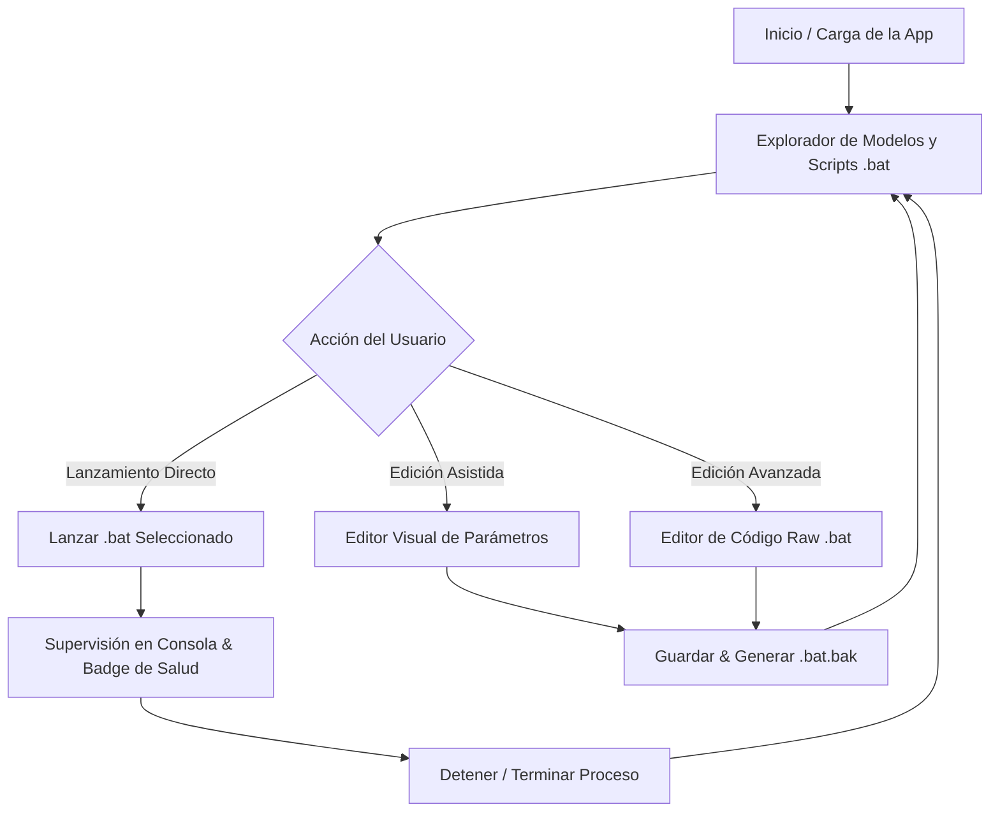

# Especificación de Diseño y Arquitectura — LlamaLaunch 🦙🚀

> **Estado del Documento:** Aprobado para Implementación  
> **Ámbitos Cubiertos:** UX/UI (`/designUxUi`), Contrato de API (`/apiDesign`), Estrategia de Pruebas Backend (`/backendTesting`).  
> **Directorio de Modelos Objetivo:** `G:\My Drive\AI Local\models`  
> **Directorio de Binarios:** `llamaLauncher/bin/llama.cpp` y binarios dedicados locales (`models/Bonsai 2/llama.cpp`).

---

## 1. Contexto, Necesidad y Visión General

### 1.1. Diagnóstico del Sistema Actual
El frontend y backend actuales de `LlamaLaunch` operan bajo un modelo rígido:
1. **Escaneo Plano Limitado:** Solo inspecciona carpetas de categorías fijas (`edge`, `large`, `coder`) dentro de una ruta única.
2. **Inferencia Sintética Directa:** Construye los flags de ejecución CLI (`llama-server.exe`) al vuelo desde formularios genéricos de la interfaz, ignorando los scripts de arranque optimizados ya creados.
3. **Desconexión con el Ecosistema `AI Local`:** En `G:\My Drive\AI Local\models`, cada modelo (e.g., `Bonsai 2`, `Qwen 3.6 35B`, `MiMo 2.6 9B`, `Gemma 4 12B`) cuenta con scripts de arranque `.bat` minuciosamente calibrados para hardware específico (`DIEGO_DESKTOP` con RTX 5060 Ti 16GB). Estos scripts configuran:
   - Rutas dinámicas `%~dp0` y binarios CUDA/Vulkan.
   - Proyectores multimodales (`--mmproj`) BF16/Q8_0 condicionales.
   - Decodificación especulativa / MTP (`mtp-*.gguf` y flags `--spec-type draft-mtp`).
   - Parámetros de muestreo fino (`temp`, `top-p`, `top-k`, `min-p`).
   - Compresión KV Cache PolarQuant (`--cache-type-k q4_0 --cache-type-v q4_0 -fa on`).
4. **Especialización de Binarios Crítica:** 
   - **Bonsai 2 (27B Ternario):** Requiere obligatoriamente un binario dedicado de `llama.cpp` compilado con kernels para cuantizaciones ternarias (`PQ2_0`, `PTQ1_0`), ubicado en `G:\My Drive\AI Local\models\Bonsai 2\llama.cpp`. El binario estándar falla al cargar sus tensores.
   - **Compilaciones CUDA vs Vulkan:** Los binarios CUDA (`llama-b9297-bin-win-cuda-x64`) explotan la RTX 5060 Ti con Flash Attention, mientras que Vulkan (`llama-b9297-bin-win-vulkan-x64`) soporta gráficos integrados (Radeon 680M en laptops) o hardware genérico.

### 1.2. Objetivo de la Nueva Arquitectura
Evolucionar `LlamaLaunch` hacia un **Orquestador Visual y Editor de Scripts de Inferencia (.bat)** capaz de:
- Descubrir automáticamente la jerarquía de modelos y sus archivos `.bat` en `G:\My Drive\AI Local\models`.
- Visualizar, validar y **editar interactivamente** cada archivo `.bat` (modo formulario guiado y modo código fuente monoespaciado con respaldos `.bak`).
- Detectar y conmutar la versión y compilación de `llama.cpp` adecuada (Bonsai 2 Custom, CUDA 13.x, Vulkan, CPU).
- Ejecutar y supervisar el script `.bat` como subproceso controlado, capturando telemetría, logs en tiempo real y verificando salud vía endpoint `/health`.

---

## 2. Especificación UX/UI (`/designUxUi`)

### 2.1. Tareas de Usuario y Flujos de Interacción



#### Tarea 1: Navegación y Selección de Modelos
- **Vista Árbol/Grid:** Explora `G:\My Drive\AI Local\models` agrupado por carpetas de familia (`Bonsai 2`, `Qwen 3.6 35B`, `Gemma 4`, etc.).
- **Detección de Scripts:** Identifica y lista todos los scripts `.bat` encontrados en la carpeta seleccionada (e.g., `run-qwen36-35b.bat`, `run-qwen36-35b-mtp-coding.bat`).
- **Badges de Características:** Muestra etiquetas visuales instantáneas:
  - `CUDA` / `VULKAN` / `CUSTOM-BIN`
  - `VISIÓN` (si detecta `--mmproj`)
  - `MTP` (si detecta decodificación especulativa)
  - `FLASH-ATTN` y nivel de KV Cache (`Q4_0`, etc.).

#### Tarea 2: Edición Dual de Scripts `.bat`
- **Selector de Modo (Tabs en panel derecho o modal):**
  1. **Modo Formulario Estructurado (Safe Mode):**
     - Selector de Binario / Motor: Menú desplegable con binarios detectados (`Bonsai 2 Dedicado`, `CUDA b9297`, `Vulkan b9297`, `CPU b9283`, `Personalizado...`).
     - Selector de Archivo de Pesos (`MODEL`): Lista desplegable con archivos `.gguf` locales.
     - Selector de Proyector de Visión (`MMPROJ`): Detecta automáticamente variantes `BF16`, `Q8_0`, `F16` o `Desactivado`.
     - Controles numéricos rápidos: Puerto (`8080`), Contexto (`32768`, `204800`), Hilos (`8`), Capas GPU (`99`).
     - Toggles: Flash Attention (`--flash-attn on/off`), KV Cache PolarQuant (`q4_0`, `q8_0`, `off`).
     - Hiperparámetros de Muestreo: Temperatura, Top-P, Top-K, Min-P.
  2. **Modo Editor de Código Raw (Advanced Mode):**
     - Área de texto con tipografía monoespaciada (`Fira Code`), números de línea, resaltado de sintaxis Batch (`echo`, `set`, `if exist`, `^`).
     - Botón "Validar Sintaxis" (chequeo de comillas pares, continuaciones de línea con carets `^`, rutas relativas).
     - Botón "Guardar Cambios" con generación automática de respaldo `.bat.bak`.
     - Botón "Restaurar Copia de Seguridad" (permite revertir al archivo original si hubo error).

#### Tarea 3: Ejecución, Telemetría y Control de Ciclo de Vida
- **Botón de Arranque / Detención Principal:**
  - `STOPPED` (Botón Verde: `▶ LANZAR .BAT`).
  - `LOADING` (Botón Amarillo Animado: `⏳ CARGANDO PESOS...`).
  - `RUNNING` (Botón Rojo: `⏹ DETENER SERVIDOR`).
- **Consola de Registros:** Terminal con auto-scroll inteligente que captura `stdout` y `stderr` del script en tiempo real.
- **Acciones Rápidas del Servidor:**
  - Botón `🌐 Abrir Web UI` (`http://localhost:8080`).
  - Botón `📋 Copiar Endpoint API` (`http://localhost:8080/v1`).
  - Botón `💀 Forzar Cierre (Kill Zombies)` para liberar VRAM inmediatamente en caso de cuelgue.

---

### 2.2. Dirección Visual y Tokens de Diseño (Slate Cyberpunk Dark Mode)

El diseño se integra estrictamente con el sistema de tokens existente en `llamaLauncher/app/frontend/style.css`:

```css
:root {
    /* Fondos y Superficies */
    --bg-base: #090d16;          /* Fondo global de la ventana */
    --bg-surface: #0f172a;       /* Paneles y barras laterales */
    --bg-card: #1e293b;          /* Tarjetas y contenedores de formularios */
    --bg-input: #0f172a;         /* Inputs, selects y consola */

    /* Tipografía y Textos */
    --text-primary: #f8fafc;     /* Títulos y texto de alto contraste */
    --text-secondary: #94a3b8;   /* Etiquetas descriptivas y subtítulos */
    --text-muted: #64748b;       /* Metadatos secundarios, placeholders */

    /* Acentos y Estados */
    --accent-blue: #38bdf8;      /* Acciones principales, selección activa */
    --accent-emerald: #10b981;   /* Servidor corriendo / Éxito */
    --accent-amber: #fbbf24;     /* Servidor cargando / Advertencias */
    --accent-rose: #f43f5e;      /* Detener servidor / Errores / Peligro */
    
    /* Bordes y Sombras */
    --border-color: #334155;     /* Líneas divisorias de tarjetas */
    --border-glow: rgba(56, 189, 248, 0.15);

    /* Tipografías */
    --font-sans: 'Outfit', -apple-system, BlinkMacSystemFont, "Segoe UI", sans-serif;
    --font-mono: 'Fira Code', 'Courier New', monospace;
    --border-radius: 12px;
}
```

---

### 2.3. Matriz de Estados de la Interfaz

| Estado | Indicador Visual | Controles Habilitados | Mensaje / Feedback |
|---|---|---|---|
| **IDLE / STOPPED** | Badge gris/rojo apagado `STOPPED` | Selección de modelo, edición de `.bat`, botón de inicio activo | "Listo para iniciar inferencia." |
| **LOADING** | Badge amarillo con pulso `LOADING` | Edición deshabilitada temporalmente, botón cancelar disponible | "Cargando grafo de tensores en VRAM..." |
| **RUNNING** | Badge verde con brillo esmeralda `ONLINE` | Botón Detener activo, enlace a Web UI activo, edición bloqueada | "Servidor activo en http://localhost:8080/v1" |
| **EDITING_UNSAVED** | Píldora ámbar `Cambios sin guardar` | Botones "Guardar" y "Descartar" activos | "Modificaciones pendientes de escritura a disco." |
| **ERROR_CRASH** | Badge rojo parpadeante `CRASHED` | Botón "Ver Logs de Error", "Restaurar .bak", "Reintentar" | "El proceso terminó inesperadamente (Código de salida != 0)." |

---

## 3. Especificación del Contrato de API (`/apiDesign`)

La comunicación entre el Frontend de escritorio (JavaScript) y el Backend (Python) se realiza a través de la fachada **`ApiBridge`** expuesta por `pywebview`, garantizando además compatibilidad con un modo REST/JSON para ejecuciones remotas o en contenedor (TrueNAS / Docker WebTop).

### 3.1. Métodos de la Fachada `ApiBridge` (Desktop IPC)

#### `scan_models_and_batches()`
- **Propósito:** Descubre la estructura completa de modelos, carpetas y scripts `.bat`.
- **Entrada:** Ninguna (utiliza la ruta raíz configurada `G:\My Drive\AI Local\models`).
- **Respuesta:**
  ```json
  {
    "success": true,
    "root_dir": "G:\\My Drive\\AI Local\\models",
    "models": [
      {
        "id": "bonsai-2",
        "name": "Bonsai 2",
        "folder_path": "G:\\My Drive\\AI Local\\models\\Bonsai 2",
        "custom_binary_path": "G:\\My Drive\\AI Local\\models\\Bonsai 2\\llama.cpp\\llama-server.exe",
        "has_dedicated_binary": true,
        "weights": [
          {"filename": "Ternary-Bonsai-2-27B-PQ2_0.gguf", "size_gb": 6.71, "type": "model"},
          {"filename": "Ternary-Bonsai-2-27B-mmproj-Q8_0.gguf", "size_gb": 0.58, "type": "mmproj"}
        ],
        "batch_scripts": [
          {
            "filename": "run-bonsai2.bat",
            "path": "G:\\My Drive\\AI Local\\models\\Bonsai 2\\run-bonsai2.bat",
            "last_modified": "2026-10-02T09:23:23",
            "has_backup": true
          }
        ]
      },
      {
        "id": "qwen-36-35b",
        "name": "Qwen 3.6 35B",
        "folder_path": "G:\\My Drive\\AI Local\\models\\Qwen 3.6 35B",
        "has_dedicated_binary": false,
        "weights": [
          {"filename": "Qwen3.6-35B-A3B-UD-IQ3_S.gguf", "size_gb": 15.3, "type": "model"},
          {"filename": "mmproj-Qwen3.6-35B-A3B-Q8_0.gguf", "size_gb": 0.61, "type": "mmproj"}
        ],
        "batch_scripts": [
          {
            "filename": "run-qwen36-35b.bat",
            "path": "G:\\My Drive\\AI Local\\models\\Qwen 3.6 35B\\run-qwen36-35b.bat",
            "last_modified": "2026-10-02T09:23:27",
            "has_backup": false
          },
          {
            "filename": "run-qwen36-35b-mtp-coding.bat",
            "path": "G:\\My Drive\\AI Local\\models\\Qwen 3.6 35B\\run-qwen36-35b-mtp-coding.bat",
            "last_modified": "2026-10-02T09:23:27",
            "has_backup": false
          }
        ]
      }
    ]
  }
  ```

---

#### `get_batch_details(batch_path: str)`
- **Propósito:** Lee un archivo `.bat`, recupera su contenido sin procesar y extrae los parámetros clave mediante parsing de variables y flags.
- **Entrada:** `batch_path` (Ruta absoluta al script).
- **Respuesta:**
  ```json
  {
    "success": true,
    "path": "G:\\My Drive\\AI Local\\models\\Bonsai 2\\run-bonsai2.bat",
    "raw_content": "@echo off\nsetlocal\n...",
    "parsed_config": {
      "port": 8080,
      "host": "0.0.0.0",
      "model_file": "Ternary-Bonsai-2-27B-PQ2_0.gguf",
      "mmproj_file": "Ternary-Bonsai-2-27B-mmproj-Q8_0.gguf",
      "binary_dir": "%BASEDIR%llama.cpp",
      "binary_type": "dedicated",
      "n_gpu_layers": 99,
      "flash_attn": "on",
      "ctx_size": 204800,
      "ubatch_size": 512,
      "cache_type_k": "q4_0",
      "cache_type_v": "q4_0",
      "temp": 1.0,
      "top_p": 0.95,
      "top_k": 20,
      "min_p": 0.0,
      "alias": "bonsai-2-27b"
    }
  }
  ```

---

#### `save_batch_script(batch_path: str, raw_content: str, create_backup: bool = True)`
- **Propósito:** Valida y persiste las modificaciones del archivo `.bat` en disco de forma atómica.
- **Entrada:**
  - `batch_path`: Ruta del archivo `.bat`.
  - `raw_content`: Texto íntegro del script a guardar.
  - `create_backup`: Si es `true`, crea previamente `<batch_path>.bak`.
- **Respuesta:**
  ```json
  {
    "success": true,
    "message": "Script guardado exitosamente. Respaldo creado en run-bonsai2.bat.bak.",
    "backup_path": "G:\\My Drive\\AI Local\\models\\Bonsai 2\\run-bonsai2.bat.bak",
    "bytes_written": 1284
  }
  ```

---

#### `launch_batch_script(batch_path: str)`
- **Propósito:** Ejecuta el archivo `.bat` como subproceso supervisado con aislamiento de grupo de procesos (`CREATE_NEW_PROCESS_GROUP`).
- **Entrada:** `batch_path`.
- **Respuesta:**
  ```json
  {
    "success": true,
    "pid": 14220,
    "port": 8080,
    "script_name": "run-bonsai2.bat",
    "message": "Script de inferencia iniciado en segundo plano. Monitoreando carga..."
  }
  ```

---

#### `get_available_binaries()`
- **Propósito:** Lista los motores preinstalados en `llamaLauncher/bin/llama.cpp` y detecta binarios específicos por modelo.
- **Respuesta:**
  ```json
  {
    "success": true,
    "binaries": [
      {
        "id": "cuda-b9297",
        "name": "NVIDIA CUDA 13.x (b9297)",
        "path": "C:\\git\\LlamaLaunch\\llamaLauncher\\bin\\llama.cpp\\llama-b9297-bin-win-cuda-x64\\llama-server.exe",
        "type": "CUDA",
        "recommended_for": ["RTX 5060 Ti", "GTX 1660 Super"]
      },
      {
        "id": "vulkan-b9297",
        "name": "Vulkan Universal (b9297)",
        "path": "C:\\git\\LlamaLaunch\\llamaLauncher\\bin\\llama.cpp\\llama-b9297-bin-win-vulkan-x64\\llama-server.exe",
        "type": "VULKAN",
        "recommended_for": ["AMD Radeon 680M", "Intel Arc"]
      },
      {
        "id": "cpu-b9283",
        "name": "CPU AVX2 Pure (b9283)",
        "path": "C:\\git\\LlamaLaunch\\llamaLauncher\\bin\\llama.cpp\\llama-b9283-bin-win-cpu-x64\\llama-server.exe",
        "type": "CPU",
        "recommended_for": ["Fallback sin GPU"]
      },
      {
        "id": "bonsai2-dedicated",
        "name": "Bonsai 2 Dedicated Ternary Fork (CUDA)",
        "path": "G:\\My Drive\\AI Local\\models\\Bonsai 2\\llama.cpp\\llama-server.exe",
        "type": "CUSTOM_TERNARY",
        "recommended_for": ["Ternary-Bonsai-2-27B (PQ2_0 / PTQ1_0)"]
      }
    ]
  }
  ```

---

### 3.2. Manejo Estructurado de Errores (RFC 9457 Problem Details)
En caso de fallos en llamadas API o IPC, las respuestas de error siguen el estándar RFC 9457:
```json
{
  "type": "https://llamalaunch.local/errors/batch-syntax-error",
  "title": "Error de Sintaxis en Script Batch",
  "status": 400,
  "detail": "El comando en la línea 24 presenta un caret '^' huérfano sin continuación de argumento válida.",
  "instance": "/batches/run-bonsai2.bat",
  "invalid_line": 24
}
```

---

## 4. Estrategia y Pruebas Automatizadas de Backend (`/backendTesting`)

### 4.1. Matriz de Riesgo y Cobertura

| Componente / Riesgo | Evidencia de Origen | Nivel de Prueba | Oráculo Observable | Prioridad |
|---|---|---|---|---|
| **Parsing de Scripts .bat** (Variables, flags de `llama-server`, comillas) | Scripts reales en `G:\My Drive\AI Local\models\*.bat` | Unitaria | Diccionario `parsed_config` contiene `port`, `ctx_size`, `model`, `binary_dir` exactos | Alta (P0) |
| **Persistencia Atómica y Respaldo `.bak`** | Fallo de disco / sobreescritura accidental | Integración | Archivo `.bak` existe con contenido previo idéntico; nuevo archivo tiene codificación CRLF válida | Alta (P0) |
| **Detección de Binario Dedicado (Bonsai 2 vs CUDA)** | Restricción técnica de modelos ternarios | Unitaria | Resolver `binary_path` prioriza carpeta local del modelo antes del catálogo global | Alta (P0) |
| **Lanzamiento de Subproceso Batch y Monitoreo** | Cuelgues de proceso, desbordamiento de memoria | Integración (Mock) | Script batch de prueba genera PID activo, responde `/health` y captura logs en `active_server.log` | Alta (P0) |
| **Terminación Limpia y Limpieza de Zombis** | Fuga de VRAM al detener el servidor | Integración | `stop_server()` mata el árbol de procesos completo (`taskkill /F /T /PID`) sin dejar huérfanos | Media (P1) |
| **Prevención de Colisión de Puertos** | Puerto 8080 en uso por otro servicio | Unitaria / Sistema | Detección previa mediante socket check; advierte al usuario o propone puerto libre alternativo | Media (P1) |

---

### 4.2. Estrategia de Dobles de Prueba (Test Doubles)
Para asegurar que los tests se ejecuten en CI o localmente en milisegundos sin requerir una GPU de 16 GB ni descargar pesos GGUF reales de 35 GB:
- **`DummyModelDirectory`:** Fixture temporal creada con `tempfile.TemporaryDirectory` que simula la jerarquía de `models/Bonsai 2` con archivos vacíos `.gguf` y un `.bat` representativo.
- **`MockLlamaServer`:** Script `.bat` ligero de prueba (`mock_server.bat`) que simula la salida de `llama-server`, escucha en un puerto de prueba con un servidor HTTP embebido o duerme 10 segundos para probar `launch`, `log streaming` y `stop`.
- **`SpyProcessManager`:** Registra las señales `SIGTERM` / `taskkill` y verifica que el PID hijo y sus descendientes sean cancelados.

---

### 4.3. Estructura de Suites de Prueba

Las pruebas residirán en `llamaLauncher/tests/` (y serán invocadas desde `testLauncher.py`):

1. **`test_batch_parser.py`:**
   - Valida la extracción de parámetros de `run-bonsai2.bat`, `run-qwen36-35b.bat`, `run-gemma4-12b.bat`.
   - Comprueba la regeneración del script a partir del formulario interactivo sin alterar flags de entorno (`%~dp0`, `!MMPROJ_FLAG!`).
2. **`test_binary_resolver.py`:**
   - Comprueba que para `Bonsai 2` el binario resuelto sea el local dedicado.
   - Comprueba que para `Qwen 3.6` se elija CUDA si existe NVIDIA, o Vulkan si no hay GPU dedicada.
3. **`test_batch_lifecycle.py`:**
   - Inicia un `.bat` simulado, lee logs reactivos y verifica la detención con `kill_all_zombies()`.

---

## 5. Criterios de Aceptación Técnica

1. **Autonomía Operativa:** El usuario puede seleccionar cualquier modelo existente en `G:\My Drive\AI Local\models`, ver sus scripts `.bat`, editarlos en la interfaz y ejecutarlos con un solo clic.
2. **Seguridad de Datos:** Ningún script `.bat` puede sobrescribirse sin haber generado previamente una copia de seguridad `.bak`.
3. **Respeto a Bonsai 2:** La interfaz y el backend reconocen de forma nativa que Bonsai 2 requiere su binario propietario, previniendo errores de tensores incompatibles.
4. **Verificación de Suite:** Todas las pruebas automatizadas en `testLauncher.py` deben ejecutarse y reportar verde (`OK`) en el entorno Windows del usuario.
