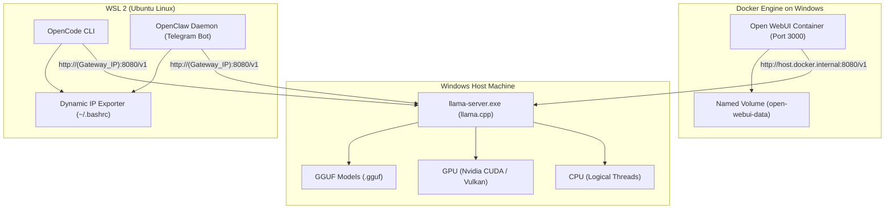
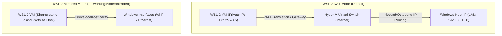

# System Architecture: Local AI Infrastructure 🏗️

This document details the design and high-performance hybrid architecture implemented in your local environment to run artificial intelligence models and autonomous agents with maximum performance, efficiency, and data security.

---

## 🗺️ Hybrid Architecture Map

Your infrastructure utilizes an optimized hybrid design:
*   **Heavyweight Inference on Windows Host**: To directly leverage your GPU drivers (Nvidia CUDA or Vulkan) or the CPU without the virtualization overhead of network translation or GPU passthrough in WSL.
*   **Services and Interface in Docker Containers**: Open WebUI runs inside a Docker container, ensuring a clean and isolated environment while persisting chat and user data to fast physical disks.
*   **Autonomous Agents in WSL (Ubuntu)**: Agent CLI development tools such as OpenCode and OpenClaw run on Linux, which is their native environment for maximum compatibility and speed.

### Virtualization and Hardware Delegation Layer (Windows, Hyper-V, WSL 2)

The system leverages the capabilities of the underlying Type-1 **Microsoft Hyper-V** hypervisor in Windows 11 to optimally segment workloads. By separating heavyweight inference computation (executed bare-metal on the Windows host using native drivers) from the agent orchestration system (within the WSL 2 virtual machine) and the graphical user interface (Docker Desktop via the WSL 2 backend), it avoids performance losses of up to 15-20% associated with GPU virtualization and kernel-level system call translation overhead.



---

## 🧩 System Components

### 1. Inference Engine: `llama.cpp`

It is the heart of the system. It processes models in **GGUF** format and exposes a local REST API that is 100% compatible with the OpenAI API.

*   **Location**: `C:\temp\AI Local\bin\llama.cpp\`
*   **Configurations**: Unified for CPU (utilizing vectorized SIMD instructions such as AVX2 and AVX-512), Nvidia CUDA GPU, and Vulkan GPU.

#### 🔍 KV Cache Quantization and Memory Optimizations

To mitigate the bottleneck caused by the growth of the **KV Cache** (Key-Value Cache) during extended conversation contexts, `llama.cpp` allows for the optimization and compression of key (K) and value (V) tensor storage in physical memory (VRAM or RAM). The KV Cache size scales linearly-quadratically with context length, number of layers, and attention heads. Using the `--cache-type-k` and `--cache-type-v` parameters, the engine allows applying various precision formats:

*   **`f16` (Default)**: 16-bit floating-point precision with no information loss. It offers the highest theoretical quality but consumes the most VRAM.
*   **`q8_0` (8-bit Quantization)**: Compresses the KV Cache size by 50% with negligible model perplexity loss (usually < 0.005). This is the recommended standard to maximize context length without degrading logical precision.
*   **`q4_0` (4-bit Quantization)**: Offers a massive 75% VRAM savings. It is indispensable for enabling ultra-long contexts (e.g., 32K to 64K tokens) on resource-constrained consumer hardware. It may induce minor coherence degradation in complex programming tasks.

> [!NOTE]
> **Hadamard-Lloyd Weight Quantization (HLWQ)** (historically also known as PolarQuant in the ecosystem) is a mathematical post-training quantization method that uses block-wise normalization, Walsh-Hadamard rotations, and Lloyd-Max scalar quantization to compress model weights to very low precisions (e.g., 4-bit) while minimizing perplexity degradation.

#### ⚡ Flash Attention Algorithm and GPU I/O

The engine integrates support for **Flash Attention** (enabled via the `-fa` or `--flash-attn` flags), a computation reordering algorithm designed specifically to address the data transfer bottleneck in GPU memory.

*   **The Problem**: The standard attention mechanism computes the softmax affinity matrix $A = \text{softmax}(QK^T) \in \mathbb{R}^{N \times N}$. As the sequence length $N$ increases, the intermediate matrix $A$ scales quadratically ($O(N^2)$). This forces the GPU to constantly write to and read large data blocks from High Bandwidth Memory (HBM), which has a limited bandwidth and generates a severe I/O bottleneck.
*   **The Solution (Tiling and Kernel Fusion)**: Flash Attention does not write the complete $N \times N$ attention matrix to HBM. Instead, it implements a partitioning technique (**Tiling**) that divides the input Query, Key, and Value matrices into small blocks designed to fit directly into the ultra-fast on-chip memory (**SRAM**) of the GPU, which has a bandwidth roughly 10 times higher than HBM.
*   **Online Softmax**: Computes the Softmax operation block-by-block incrementally and continuously (Online Softmax), maintaining updated local scaling statistics to guarantee exact mathematical equivalence to the traditional computation without storing the entire intermediate affinity matrix in memory.
*   **Recomputation in Backward Pass**: Instead of storing the entire intermediate attention matrix from the forward pass (which consumes linear-quadratic memory), the algorithm rapidly recomputes it on the fly during the backward pass using saved lightweight statistics. By replacing expensive read/write accesses to HBM (a physical bottleneck) with fast arithmetic operations in SRAM (cheap computation), Flash Attention reduces memory consumption from $O(N^2)$ to $O(N)$ and dramatically accelerates inference.

#### 🧠 SOTA Model Architectures: Google Gemma and Qwen 2.5 Coder

This infrastructure is optimized to run next-generation open architectures, which incorporate key innovations in transformer design:

1.  **Grouped-Query Attention (GQA)**: Implemented in models like Qwen 2.5 Coder, GQA groups multiple Query heads (e.g., 8 heads) to share a single Key and Value head (instead of the traditional 1:1 ratio). This drastically reduces the in-memory KV Cache size in the same proportion, accelerating generation speed and context capacity.
2.  **Rotary Position Embedding (RoPE)**: Replaces absolute positional encodings with rotational embeddings that apply an orthogonal transformation to the attention vectors based on the relative distance between tokens. Qwen 2.5 Coder implements YaRN (Yet another RoPE) extensions to achieve dynamic and coherent context length scaling up to 128K tokens.
3.  **SwiGLU Activation Function**: Used in FFNs (Feed-Forward Networks), it replaces the standard ReLU or GELU activation with a bilinear gating mechanism coupled with the Swish activation:
    $$\text{SwiGLU}(x) = (\text{Swish}_{\beta}(xW) \cdot xV)U$$
    This mathematical formulation provides a much richer modeling capability to capture rigorous syntactic relations and structures in source code generation.

### 2. User Interface: `Open WebUI`

A beautiful ChatGPT-style web interface to interact with your models in Spanish, create system prompts, and manage your chat history.

*   **Location**: `C:\temp\AI Local\services\open-webui\`
*   **Deployment**: Docker Compose on port `3000`.
*   **Network**: Accesses Windows via the `host.docker.internal` tunnel.
*   **Persistence**: High-performance Docker named volume (`open-webui-data`) to prevent data and chat history loss when stopping or updating the container.

#### 💾 SQLite Persistence and Performance in Docker/WSL 2

Open WebUI stores all its user, chat, prompt, and configuration information by default in a **SQLite** database. SQLite is a highly efficient embedded transactional database engine that writes directly to a single disk file, making it extremely sensitive to the physical and semantic properties of the filesystem.

*   **The Problem with Bind Mounts**: Mapping a physical directory from the Windows host to a Docker container in WSL 2 using a *bind mount* (e.g., `-v C:\temp\data:/data`) forces all I/O operations to traverse the **`drvfs`** virtualized filesystem (the Windows/WSL 9P translation protocol). This protocol translates Linux POSIX system calls to the Windows NTFS API in real time. Consequently, physical disk synchronization operations (`fsync`), transaction concurrency control, and the **POSIX `fcntl` locks** required by SQLite to operate in secure transactional mode (WAL - Write-Ahead Logging mode) suffer severe translation latencies or fail entirely. This results in constant critical "database is locked" exceptions (`SQLITE_BUSY`) and increases the risk of physical file corruption.
*   **The Solution (Named Volume on ext4)**: In this architecture, the `open-webui-data` volume is deployed as a **Docker-managed named volume**. This physical volume resides entirely within the native Linux partition of the WSL 2 subsystem (which operates with an **ext4** filesystem encapsulated in a virtual `.vhdx` disk). Operating natively on ext4 within Linux provides SQLite with full, ultra-low latency support for efficient POSIX file locking and direct calls to the Linux kernel buffer (`page cache`). This completely eliminates database lock errors and ensures native transfer rates and I/O speeds.

### 3. Background Assistant: `OpenClaw`

An autonomous bot running as a background daemon in your WSL/Ubuntu environment, linking directly to your private Telegram chat.

*   **Location**: `C:\temp\AI Local\services\openclaw\`
*   **Channel**: Telegram Bot (free via `@BotFather`).
*   **Engine**: Node.js v22 managed via NVM on Linux. Its communication utilizes asynchronous outbound *long-polling* to the Telegram servers, which avoids having to expose inbound ports on the user's router.

### 4. Programming Copilot: `OpenCode`

An autonomous terminal console agent (TUI) that analyzes your local projects and programs for you.

*   **Location**: `C:\temp\AI Local\services\opencode\`
*   **Network**: Uses a dynamic environment variable to automatically track the Windows IP via the WSL network gateway.
*   **Security**: Incorporates the *Claude Code* concept of **Interactive Safety Gating**. Each read, write, or console command action requires explicit user confirmation (`Y/N`). The agent cannot self-approve system actions, guaranteeing the security of your local environment.

---

## 🔄 Data Flow and Networking

Due to the virtualized nature of Docker and WSL 2, local network communication has been resolved in three distinct ways to ensure stability:

| Source | Destination | Connection Method | Rationale |
| :--- | :--- | :--- | :--- |
| **Docker Container** (Open WebUI) | **Windows Host** (llama-server) | `http://host.docker.internal:8080/v1` | Native gateway address provided by the Docker Desktop proxy on Windows. |
| **WSL 2 VM** (OpenCode / OpenClaw) | **Windows Host** (llama-server) | `http://(Host_Gateway_IP):8080/v1` | Dynamic resolution by reading the Linux routing table on every shell startup (`~/.bashrc`). |
| **Telegram API** (Cloud) | **WSL 2 VM** (OpenClaw) | Outbound bot long-polling | Avoids having to open public network ports on your home router; the bot securely polls for updates from Telegram via outbound connections. |

---

### 🌐 Network Architectures in WSL 2: NAT vs. Mirrored Networking

WSL 2 runs an extremely lightweight Linux virtual machine and, therefore, requires a network virtualization layer to communicate with the host Windows operating system and the external environment. Microsoft supports two fundamentally different network architectures for WSL 2:



#### A. NAT Mode (Traditional Default Architecture)
In this traditional configuration:
1.  **Hyper-V Switch**: WSL 2 creates an internal Hyper-V virtual switch. The Linux VM receives a randomly assigned private IP address within an isolated local subnet (typically in the internal `172.x.x.x` or `192.168.x.x` range).
2.  **Network Address Translation (NAT)**: Outbound traffic from the Linux VM is routed through Windows using Network Address Translation (NAT). For the agent to access the Windows host, it must dynamically determine the virtual gateway IP (`Host_Gateway_IP`) on every shell startup, since subnet ranges change dynamically with each machine reboot.
3.  **Inbound Access**: Services running inside the Linux VM are not visible to the user's local network (LAN) without explicit port forwarding configuration (`portproxy` via `netsh`) on the Windows host.

#### B. Mirrored Network Mode (`networkingMode=mirrored`)
Introduced to the platform starting with WSL v2.0+ (available in Windows 11 22H2+):
1.  **IP Address Parity**: Eliminates the intermediate virtual NAT network and directly **mirrors** all physical and virtual Windows network interfaces into the Linux subsystem. The VM shares the exact same network presence and LAN IP address as the Windows host.
2.  **Bidirectional Localhost Parity**: Allows direct binding to `localhost`. This means processes in WSL 2 and Windows can communicate bidirectionally using the loopback address `127.0.0.1` or `localhost` directly without requiring proxies or dynamic IP calculations.
3.  **Enhanced Compatibility**: Natively resolves connectivity issues with enterprise VPN clients, IPv6 traffic, and support for multicast protocols.
4.  **Hyper-V Firewall Integration**: In mirrored mode, since Linux is directly exposed to the host's physical network, firewall rules become highly relevant. Windows applies the **Hyper-V Firewall** to filter incoming connections targeting WSL.
    If a service is started in WSL 2 in mirrored mode (e.g., port `80`) and needs to be accessible from other LAN devices, an inbound rule must be added to the host via PowerShell:
    ```powershell
    New-NetFirewallHyperVRule -Name "WSL2Port80" -DisplayName "Allow HTTP WSL 2" -Direction Inbound -VMCreatorId "{40E0AC32-46A5-438A-A0B2-2B479E8F2E90}" -Protocol TCP -LocalPorts 80
    ```
    *(The GUID `{40E0AC32-46A5-438A-A0B2-2B479E8F2E90}` is the standardized unique identifier of the WSL 2 virtual machine creator in the Windows operating system).*

---

### 📊 I/O Performance Analysis: Bind Mounts (`drvfs`) vs. Named Volume (`ext4`)

The storage architecture in virtualized Docker environments on WSL 2 critically defines system latency and the durability of your infrastructure's persistent data.

#### 📁 Bind Mounts over NTFS (`drvfs` / 9P / `virtio-fs`)
Mapping a physical path from the host Windows filesystem (e.g., `-v C:\temp\data:/data`) inside a running Docker container within the Linux VM involves the following workflow:
1.  **System Call Translation**: Each read, write, or metadata query I/O operation issued by the containerized application is intercepted by the WSL 2 kernel and redirected to the **`drvfs`** virtualized filesystem layer (the 9P translation protocol).
2.  **Metadata Overhead**: The driver must synchronously translate Linux POSIX file permissions to Windows NTFS security Access Control Lists (ACLs), as well as adapt path formats and file identifiers.
3.  **Virtualized Bus Latency**: Synchronization across the virtual communication channel between the Windows host and the Linux guest introduces substantial I/O latency, causing performance to drop by 10x to 100x in operations with a high volume of small files (such as massive database reads/writes or `node_modules` directories).

#### 📦 Named Volumes over ext4 (Native in VHDX)
Mapping a named volume managed directly by the Docker daemon (e.g., `-v open-webui-data:/app/backend/data`):
1.  **Direct Block Device Operation**: Physically, storage is encapsulated in the WSL 2 dynamically expanding virtual disk file **`ext4.vhdx`** on the Windows disk. From the perspective of Linux and the Docker container, reads and writes are executed natively at the block level on the `/dev/sdX` virtual storage device.
2.  **Native ext4 Filesystem**: Requires no NTFS security translation or external metadata handling. Consistency and control are fully resolved natively by the Linux kernel.
3.  **Page Cache Leveraging**: Hot reads and writes are resolved asynchronously in the RAM allocated to the Linux VM, providing ultra-low latencies and exponentially increasing IOPS (Input/Output Operations Per Second).

#### ⚖️ WSL 2 Filesystem Performance Comparison Table

| Performance Metric | Bind Mount over NTFS (`drvfs` / 9P) | Named Volume over ext4 (Native VHDX) | Practical Impact |
| :--- | :--- | :--- | :--- |
| **Operation Latency** | **High (~5 - 15 ms)** due to synchronous system call translation. | **Ultra-low (< 0.1 ms)**, directly to the RAM buffer. | Visible delays or freezing of the Open WebUI interface when navigating chats if a bind mount is used. |
| **Random Write Performance (4KB IOPS)** | **Very Low (~500 IOPS)**. | **High (~45,000 IOPS)**. | Log writes, history storage, and per-second temporary file generation. |
| **File Locking Support (`fcntl` / POSIX)** | **Incomplete / Unstable** (Poor translation in NTFS). | **Complete / Native** standard implementation. | Running SQLite on `drvfs` causes constant locks and file corruption (`SQLITE_BUSY`). |
| **ACID Transactional Consistency** | Compromised during power outages due to in-transit translation. | Fully guaranteed via ext4 *Journaling*. | Data durability and integrity against abrupt virtual machine or Windows shutdowns. |
| sequential Read Performance | Moderate (~250 MB/s). | Physical speed limit of your NVMe (~3500+ MB/s). | Initial interface server load speed and local embeddings reading. |

---

## 🤖 Agentic System Architecture (Claude Code Adaptation)

Following the findings of the **Claude Code npm package leak (v2.1.88, March 2026)**, your private infrastructure integrates advanced, production-grade agentic coordination mechanics mapped to your local hardware capabilities. These techniques bridge the gap between large cloud models (with 200K+ context windows) and edge-running models (with compact 8K-16K windows) while guaranteeing strict environmental safety.

```mermaid
graph TD
    subgraph Agentic_Control_System ["Agentic Core (Claude Code Architecture)"]
        IP_Mem["PROJECT.md (Workspace Memory)"] --> PA["assemble-prompt.py (Prompt Assembler)"]
        P_Frag["Prompt Fragments (core, modes, tool rules)"] --> PA
        
        PA -->|Dynamically Assembled System Prompt| OWebUI["Open WebUI Interface"]
        PA -->|Compiled System Context| OCode["OpenCode Terminal TUI"]
        
        OCode -->|Action Request| PreHook["pre_action.sh (Risk & Blast Radius Gate)"]
        PreHook -->|Low Risk: Read/Grep| ToolExec["Auto-Approve Tool Execution"]
        PreHook -->|Med/High Risk: Write/Shell| GitStash["Automated git stash snapshot"]
        GitStash -->|User Confirm Y/N| ToolExec
        
        ToolExec --> PostHook["post_action.sh (Syntactic Verification)"]
        PostHook -->|AST/JSON/Bash Checks| Compactor["context-compactor.py (3-Tier Compaction)"]
        Compactor -->|Tier 1: Sliding Window| ContextOut["Optimized Context Budget"]
        Compactor -->|Tier 2: Microcompact Regex| ContextOut
        Compactor -->|Tier 3: Local LLM Summarize| ContextOut
        
        ContextOut -->|Feeds Next Iteration| OCode
    end
```



### 1. Dynamic Prompt Assembly & Workspace Memory
Rather than inlining a massive, monolithic system prompt that exhausts 60% of the active context before a session begins, the architecture leverages the **Dynamic Prompt Assembler** (`assemble-prompt.py`):
*   **Modular Prompt Fragments (`services/open-webui/prompts/`)**: The core assistant behavior is split into modular Markdown files (`core_identity.md`, `mode_plan.md`, `mode_code.md`, `mode_explore.md`, `tool_rules.md`, `agentic_loop.md`). These are compiled dynamically on the fly based on the active agent mode (Planning, Coding, or Exploring).
*   **Workspace Memory Anchoring (`PROJECT.md`)**: Replicating Claude Code's `CLAUDE.md` design, a root-level `PROJECT.md` acts as the persistent cognitive anchor of the project, detailing development styles, system configurations, and past lessons learned. This file is parsed and injected directly into the system context at every execution startup.

### 2. 3-Tier Context Compaction Pipeline
Because consumer-grade models running locally operate within tight context limits (optimized to **6,692 tokens** in `opencode_config.json` to fit inside GPU/VRAM limits), the system deploys an aggressive context-management pipeline:
*   **Tier 1: Session Memory:** Preserves the core system prompt, the root `PROJECT.md` context, and applies a sliding window to the conversation, retaining only the initial prompt (goal alignment) and the latest 10 messages.
*   **Tier 2: Microcompact (Noise Pruning):** An optimized regex cleanup script (`context-compactor.py`) sweeps the raw chat history, removing heavy Base64 image strings, truncating shell logs longer than 50 lines (leaving only the first and last few lines), collapsing duplicate code blocks, and trimming large JSON blocks.
*   **Tier 3: Summarization:** When the token count exceeds the defined budget, the system issues an asynchronous background API request to the local `llama-server` at a low temperature (0.3). The model condenses older conversation blocks into a single structured paragraph that replaces those blocks in the history, preventing context overflow and semantic drift.

### 3. Risk Gating & Automated Working Tree Recovery
Autonomous loops require safeguards to prevent environment corruption. The system implements a dedicated security matrix:
*   **Risk Classification Matrix (`tool_permissions.json`)**: Tools are categorized into risk levels. Low-risk operations (reading, grepping, globbing) are auto-approved. Medium and High-risk operations (writing files, executing shell commands, managing Git pushes) trigger interactive safety prompts.
*   **Pre-Action Snapshots (`pre_action.sh`)**: Before any write or execution command takes place, the shell hook checks if the Git directory is dirty. If untracked or modified files exist, it automatically locks the state using `git stash push -m "[pre-action-hook] ..." --include-untracked`. This guarantees that if the agent makes a destructive error, the user can instantly restore their working tree using `git stash pop`.
*   **Post-Action Syntactic Verifiers (`post_action.sh`)**: After the agent edits code, the system immediately runs static code analysis (Python Abstract Syntax Tree checking with `ast.parse`, `json.load` checks, or `bash -n` syntax verification). If an error is detected, the hook reports the exact error block back to the agent's gather loop, enabling automated self-correction before the changes are exposed.
