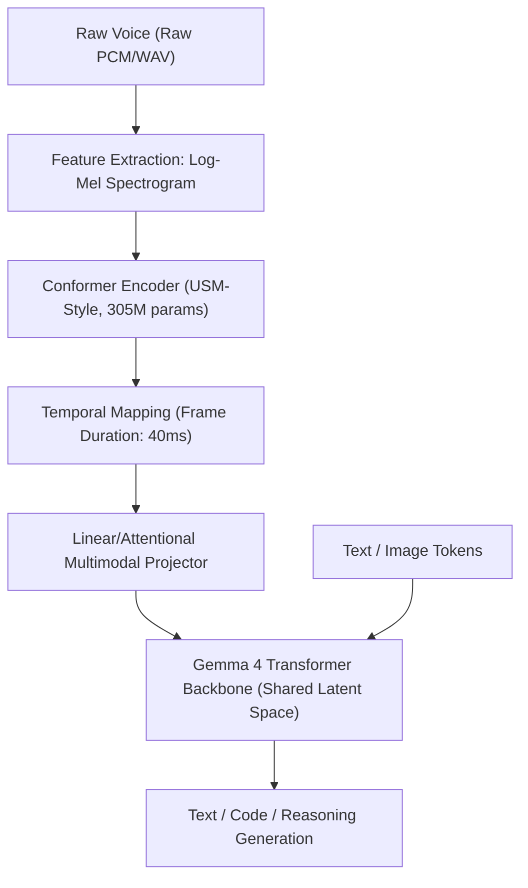

# Recommended AI Models 🧠

This document compiles the most recommended Artificial Intelligence models in **GGUF** format (optimized for ultra-fast execution with `llama.cpp`) based on your devices' hardware specifications (16GB RAM Laptop vs. 32GB RAM Main PC with GPU). Each section includes in-depth technical specifications, state-of-the-art architectural foundations, and detailed guides for optimizing local performance.

---

## 💻 For Your Laptop (16GB RAM - CPU Only)

On portable devices, we prioritize lightweight ("Edge") CPU-optimized models that respond at blistering speeds and minimize battery and memory consumption, while still maintaining advanced capabilities for logical conversations, formal reasoning, and integration into agentic programming workflows.

### 1. Gemma 4 E2B Instruct GGUF (General Conversation, Reasoning, and Multimodal Audio)

Gemma 4 is the latest open family of optimized models developed by Google DeepMind (released on April 2, 2026). The **E2B (Effective 2B)** variant represents an engineering milestone in compact models for local devices. Despite occupying just a few gigabytes on disk, its performance rivals models twice or three times its physical size, thanks to a revolutionary architecture based on **Per-Layer Embeddings (PLE)** and native raw audio processing capabilities.

#### 📊 Technical Specifications and Parameters
*   **Total Parameters (on disk):** ~5.1B
*   **Active Parameters (Compute Inference):** ~2.3B
*   **Decoder Layers:** 35 dense layers
*   **Vocabulary Size:** 262,144 tokens (native ultra-compressed support for over 140 languages)
*   **Context Window:** 128,000 tokens (128K)
*   **Local Hardware Mapping:**
    *   **GGUF File Size:** ~3.2 GB (`Q4_K_M`) or ~3.8 GB (`Q5_K_M`).
    *   **Estimated RAM Consumption:** ~4.5 GB of free RAM.
*   **Download Link:** **[Hugging Face - google_gemma-4-E2B-it-GGUF](https://huggingface.co/bartowski/google_gemma-4-E2B-it-GGUF/tree/main)**
*   **Recommended Sweet Spot:** Download `google_gemma-4-E2B-it-Q4_K_M.gguf` for maximum speed on the laptop.

---

#### 🧬 Architectural Innovation I: Per-Layer Embeddings (PLE)

In classical Transformer architectures (such as Llama 3 or GPT-4), tokens are projected through a single embedding matrix at the model's input. This vector then travels sequentially through all hidden layers. In extremely small models (2B), this creates a **representational bottleneck**: a single latent dimension must encode all morphological, syntactic, and contextual ambiguity, forcing the few attention layers to perform highly complex operations to resolve the meaning of each token.

Gemma 4 E2B breaks this limitation using the **Per-Layer Embeddings (PLE)** mechanism:
1.  **Mini-Dictionaries per Layer:** Each of the 35 hidden decoder layers contains its own local embedding table with compact dimensions (`hidden_size_per_layer_input = 256`).
2.  **Dynamic Semantic Anchoring:** As the token representation ascends through the Transformer stack, each layer injects a specific positional and semantic "anchor" or hint. This provides each decoder block with a unique local reference regarding the identity of the original token and its relationships at that stage of the processing pipeline.
3.  **Inference Efficiency:** Although the PLE embedding tables increase the file size on disk (~5.1B total parameters), they operate via fast, low-cost memory indexing during inference runtime. This allows the model to process data with the actual computational cost of a **~2.3B active parameter** model, while demonstrating cognitive capabilities equivalent to a much denser model.
4.  **Gradient Stabilization:** During training, PLE acts as a gradient channelizer that prevents gradient degradation and vanishing gradients across deep layers, drastically accelerating semantic convergence.

---

#### 🎙️ Architectural Innovation II: Multimodal Raw Audio Processing Pipeline

Unlike classical local assistants that require an intermediate Automatic Speech Recognition (ASR, such as Whisper) model to transcribe speech to text before passing it to the LLM (cascaded systems with high latency and loss of acoustic nuances), Gemma 4 E2B features a **native multimodal raw audio processing pipeline**.



1.  **Frequency Feature Extraction:** The workflow begins by transforming the raw audio signal into a two-dimensional time-frequency representation called a **log-mel spectrogram**. To achieve this, a Short-Time Fourier Transform (STFT) is calculated by applying a Hann window, mapping the signal using an HTK-scale Mel filter bank, and applying logarithmic compression.
2.  **Optimized Conformer Encoder (USM-Style):** The log-mel representation is processed by a specialized acoustic encoder of **305 million parameters**, derived from Google's *Universal Speech Model (USM)* architecture. This block combines convolutional layers (efficient at capturing local frequency and pitch features) with self-attention layers (ideal for modeling the temporal structure of speech).
3.  **40ms Frame Duration:** To ensure the model runs smoothly on laptop processors, the encoder segments the signal into **40ms** temporal windows. This reduces the number of acoustic tokens generated per second of audio by approximately 50% compared to the previous generation (Gemma 3n), mitigating the attentional bottleneck in the LLM backend while maintaining an ultra-responsive experience.
4.  **Latent Space Projection and Alignment:** The speech features extracted by the Conformer are projected through a linear and cross-attention layer directly into the same vector space inhabited by the model's text and visual embeddings. This allows the core LLM to "hear" the signal with all its nuances (intonation, accent, pauses, and speed) and process it jointly in its internal chain of thought.

---

#### 🧠 Architectural Innovation III: Hybrid Attention Mechanism and Dual RoPE

*   **Alternating Hybrid Attention:** Processing contexts of up to 128K on a CPU requires extremely strict memory management. Gemma 4 E2B implements a hybrid attention pattern in an approximate **4:1** ratio. It alternates four layers of **sliding-window local self-attention** of 512 tokens (reducing computational cost and KV Cache to linear complexity $O(N)$) with one layer of **global self-attention** to map long-range dependencies. The last layer of the network is always global attention, ensuring that the final consolidation of reasoning encompasses the entire input sequence.
*   **Dual Positional Encoding Management (RoPE):**
    *   Local layers use traditional **Rotary Positional Embeddings (RoPE)** calibrated for short distances.
    *   Global layers employ **Proportional RoPE (p-RoPE)**, a dynamic scaling method that adjusts rotation frequencies proportionally to the input context size, preventing semantic degradation or loss of cohesion when processing long documents or extensive audio transcriptions.

---

### 2. Qwen 2.5 Coder 3B Instruct GGUF (Specialized for Programming and Agents in OpenCode)

The ideal model for your laptop when using OpenCode. Developed by Alibaba Cloud, despite its compact 3.09 billion active parameters, it performs exceptionally well in coding tasks and, above all, in **Function Calling (tool use)**, comfortably outperforming traditional 7B or 8B models from the previous generation.

#### 📊 Technical Specifications and Parameters
*   **Total Parameters:** ~3.09B
*   **Context Window:** 128K tokens
*   **Attention Mechanism:** Native Grouped-Query Attention (GQA)
*   **Local Hardware Mapping:**
    *   **GGUF File Size:** ~2.1 GB (`Q4_K_M`) or ~2.5 GB (`Q5_K_M`).
    *   **Estimated RAM Consumption:** ~3.5 GB of free RAM.
*   **Download Link:** **[Hugging Face - Qwen2.5-Coder-3B-Instruct-GGUF](https://huggingface.co/bartowski/Qwen2.5-Coder-3B-Instruct-GGUF/tree/main)**
*   **Recommended Sweet Spot:** Download `Qwen2.5-Coder-3B-Instruct-Q4_K_M.gguf`.

---

#### 🤖 Agentic Optimization and Function Calling (Tool Use)

Qwen 2.5 Coder 3B Instruct is not just a code snippet generator; it is designed as the reasoning engine for **Intelligent Software Agents**. Its ability to invoke, process, and react to external tool calls (APIs, execution consoles, filesystems) stems from key refinements in its post-training phase:

1.  **Execution-Based Alignment:** During its optimization with SFT (Supervised Fine-Tuning) and DPO (Direct Preference Optimization), the model was exposed to thousands of real agentic interactions. It was trained by analyzing direct outputs from compilers, command shells, and HTTP requests, enabling it to natively understand error responses and dynamically correct its action plans.
2.  **Native Hermes-Style / XML Syntax Support:** To avoid the fragility of parsing free text (as seen in traditional ReAct prompting patterns), Qwen 2.5 Coder is strongly aligned with the use of structured XML delimiters. When provided with system-level tools, it encapsulates its calls in clean blocks like:
    ```xml
    <tool_call>
    {"name": "execute_python_code", "arguments": {"code": "import math\nprint(math.sqrt(256))"}}
    </tool_call>
    ```
    This format drastically reduces failed calls caused by improperly closed JSON braces or missing parameters, allowing local parsers to extract the call with 100% reliability and speed.
3.  **Self-Correction Mechanism and Agentic Loops:** If the agent executes a tool and the result returned in the `<observation>` section indicates a failure (e.g., `SyntaxError` or `FileNotFoundError`), Qwen 2.5 Coder does not freeze or repeat the error. It is programmed to re-evaluate its internal premises, modify the code logic, and issue a new structured tool call with corrected parameters.
4.  **KV Cache Compression via GQA in Long Contexts:** When integrated with agent frameworks that inject massive conversation histories and tool execution traces, GQA attention reduces the attentional memory footprint to one-eighth. This allows the `llama.cpp` engine to maintain ultra-fast input token processing, which is ideal for a laptop's limited CPU.

---

## 🚀 For Your Main PC (32GB RAM - Nvidia CUDA GPU)

On your desktop computer with hardware graphics acceleration and abundant RAM, we can raise the bar and use **7B and 8B parameter models**, which offer superior intelligence, flawless Spanish language handling, and full support for complex code agents.

### 1. Llama 3 8B Instruct GGUF (General Conversation and Reasoning)

Meta AI's flagship model, the undisputed leader in the 8 billion parameter category. Excellent writing ability, logic, and complex instruction following in Spanish.

#### 📊 Technical Specifications and Parameters
*   **Total Parameters:** ~8.03B
*   **Decoder Layers:** 32 layers
*   **Attention Heads (Query / KV Heads):** 32 Query heads and 8 Key-Value heads (GQA)
*   **Vocabulary Size:** 128,256 tokens (optimized with a Tiktoken-based tokenizer)
*   **Context Window:** 8,192 native tokens
*   **Local Hardware Mapping:**
    *   **GGUF File Size:** ~5.7 GB (`Q5_K_M`) or ~4.8 GB (`Q4_K_M`).
    *   **VRAM/RAM Consumption:** Loading Q5 into VRAM requires at least 6GB of free VRAM. With partial offloading, it can be dynamically distributed between the GPU and system memory.
*   **Download Link:** **[Hugging Face - Meta-Llama-3-8B-Instruct-GGUF](https://huggingface.co/bartowski/Meta-Llama-3-8B-Instruct-GGUF/tree/main)**
*   **Recommended Sweet Spot:** Download `Meta-Llama-3-8B-Instruct-Q5_K_M.gguf`.

---

#### ⚡ Optimization and Local Inference on Nvidia GPU (CUDA)

*   **Grouped-Query Attention (GQA):** Llama 3 8B employs a 4:1 ratio in its attention heads (32 Query heads for every 8 Key-Value heads). This means the memory footprint of the KV Cache (where already processed tokens are stored to avoid recomputation) is reduced by 75% compared to traditional Multi-Head attention. On the main PC with CUDA acceleration, this enables processing bursts of tokens at speeds exceeding 60 tokens per second.
*   **High-Density Tokenizer:** Its massive vocabulary allows it to encode more Spanish characters per individual token. This not only improves grammatical quality and writing style, but physically accelerates local inference by requiring fewer total tokens to express the same response.

---

### 2. Qwen 2.5 Coder 7B Instruct GGUF (Professional Programming Assistant)

Alibaba Cloud's reigning champion for local programming. Specifically designed for integration into code editors (such as VS Code, Cursor, and OpenCode), it is capable of natively resolving highly complex development issues, refactoring entire architectures, and performing multi-file static analysis using complex tools.

#### 📊 Technical Specifications and Parameters
*   **Active Parameters:** ~7.25B
*   **Decoder Layers:** 32 layers
*   **Context Window:** 128,000 tokens (128K)
*   **Attention Mechanism:** Native Grouped-Query Attention (GQA)
*   **Local Hardware Mapping:**
    *   **GGUF File Size:** ~5.3 GB (`Q5_K_M`) or ~4.7 GB (`Q4_K_M`).
    *   **VRAM/RAM Consumption:** Fits completely into Nvidia graphics cards with 8GB of VRAM using Q5_K_M quantization, achieving blazing processing speeds.
*   **Download Link:** **[Hugging Face - Qwen2.5-Coder-7B-Instruct-GGUF](https://huggingface.co/bartowski/Qwen2.5-Coder-7B-Instruct-GGUF/tree/main)**
*   **Recommended Sweet Spot:** Download `Qwen2.5-Coder-7B-Instruct-Q5_K_M.gguf`.

---

#### 🛠️ Advanced Optimization for Local Development Environments (IDE) and MCP

The Qwen 2.5 Coder 7B Instruct model represents the industry standard for local agentic development on a main PC. Its key optimizations for professional environments include:

1.  **Training on 5.5 Trillion Multilingual Code Tokens (5.5T):** Its knowledge base comprises complete GitHub repositories in over 92 programming languages, technical documentation for modern APIs, and troubleshooting threads from software forums. This provides it with a deep semantic understanding of modern software design patterns and frameworks.
2.  **Native Integration with Model Context Protocol (MCP):** It is specifically aligned to interact under Anthropic's MCP specification. The model is extraordinarily precise at translating natural language requests into structured calls for MCP tools that read files, perform local semantic disk searches, query relational databases, or execute unit tests directly in the local shell.
3.  **Robust JSON Generation without Schema Hallucinations:** One of the main weaknesses of traditional models when using tools is that they hallucinate non-existent fields or violate strict database schemas. Qwen 2.5 Coder 7B Instruct features Reinforcement Learning from Human Feedback (RLHF) focused on JSON grammatical constraints, successfully generating perfect data schemas without omitting mandatory braces or brackets.
4.  **Full CUDA Acceleration:** When quantizing the model to `Q5_K_M`, the entire weight of the tensors (~5.3 GB) and the KV Cache fits within the GPU's 8GB of VRAM (e.g., RTX 3060/4060). Offloading 100% of the layers to CUDA completely eliminates the PCIe bus bottleneck, enabling ultra-smooth code generation speeds and instantaneous processing of long prompts.

---

## 📂 Workspace Organization

Remember to place downloaded `.gguf` files in their assigned subfolders based on their category within your PC's models directory:
*   📂 `C:\temp\AI Local\models\edge\` ➡️ Small models for Laptop (e.g., Gemma 4 E2B, Qwen 3B).
*   📂 `C:\temp\AI Local\models\chat\` ➡️ Medium general conversation models (e.g., Llama 3 8B).
*   📂 `C:\temp\AI Local\models\code\` ➡️ Specialized programming models (e.g., Qwen 7B Coder).

---

## ⚙️ Advanced Execution Guide in `llama.cpp` and Inference Optimization

To extract maximum performance from these models on your devices, follow these optimization guidelines in the `llama.cpp` command line:

### 1. Laptop Optimization (CPU Only - Windows/WSL 2)
When running models on the 16GB Laptop, the processor handles all matrix computations. Configure the following parameters:
*   **Physical Thread Mapping (`-t` / `--threads`):** Configure exactly the number of **physical** cores of your CPU (not logical cores/HyperThreading). If your CPU has 6 physical cores (12 logical threads), use `-t 6`. Using more threads than physical cores causes L2/L3 cache collisions and severely slows down inference.
*   **Flash Attention Activation (`--flash-attn`):** This parameter must be enabled. It exponentially reduces KV cache memory usage and accelerates long-sequence processing on CPU by reducing unnecessary memory operations.
*   **Context Control (`-c` / `--ctx-size`):** Define a context size that matches your RAM. Although Gemma 4 and Qwen support 128K, it is recommended to limit it on your laptop to `-c 8192` or `-c 16384` to prevent RAM saturation and disk swapping (SSD Swap), which would destroy response speeds.

**Optimized Command Example for CPU:**
```bash
./llama-cli -m C:/temp/AI_Local/models/edge/google_gemma-4-E2B-it-Q4_K_M.gguf -c 8192 -t 6 --flash-attn -p "Hello, how can you help me today?"
```

### 2. Main PC Optimization (Nvidia CUDA GPU)
On your desktop PC, we want the graphics card to handle all heavy mathematical processing work:
*   **GPU Layer Offloading (`-ngl` / `--n-gpu-layers`):** Instructs `llama.cpp` how many model layers to load directly into your GPU's VRAM.
    *   For **Qwen 2.5 Coder 7B Instruct** or **Llama 3 8B**, enter `-ngl 99` (or a number higher than the total number of layers, e.g., 32 or 35) to perform a **100% layer offload** to the GPU.
    *   If your GPU runs out of VRAM due to the KV Cache in very long contexts, you can reduce this value slightly (e.g., `-ngl 28`) to free up space on the graphics card.
*   **Accelerated Compilation:** Ensure you are using a version of `llama.cpp` compiled with **CUDA** support (`cublas` or `cuda` backend) instead of the native CPU backend.

**Optimized Command Example for CUDA GPU:**
```bash
./llama-cli -m C:/temp/AI_Local/models/code/Qwen2.5-Coder-7B-Instruct-Q5_K_M.gguf -c 16384 -ngl 99 --flash-attn -p "Write a Python class to safely handle a SQLite connection pool with multi-threading support."
```

### 🛠️ GGUF Quantization Comparison (HLWQ)

When you download the recommended models, the file names indicate the quantization method used (High-Level Weight Quantization). Here is a quick guide to understanding the difference:

| Format | Precision (Bits) | Intelligence Loss (Perplexity) | Inference Speed | Recommended Use |
| :--- | :--- | :--- | :--- | :--- |
| **`Q4_K_M`** | ~4.5 bits | Very Low | Ultra-Fast | **Laptop (CPU Only)**. Ultra-low RAM consumption with exceptional logic retention. |
| **`Q5_K_M`** | ~5.5 bits | Negligible / Virtually None | High | **Main PC (GPU)**. The absolute sweet spot. Offers identical precision to FP16 with 60% memory savings. |
| **`Q8_0`** | ~8.0 bits | None | Medium-High | **Main PC (GPU with high VRAM)**. Zero semantic loss, but requires 40% more memory than Q5. |
