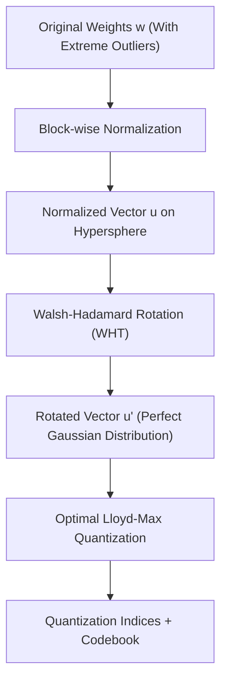

# Scripts and Control Guide 🛠️

This document explains in detail the operation, design, and internal commands of the control and startup scripts created for your local AI infrastructure in `C:\temp\AI Local`.

---

## ⚙️ Master Launcher: `start-llama.bat` & Python Orchestrator

The Master Launcher has been refactored from a rigid, monolithic CMD Batch script into a modern, modular **Python-based orchestrator backend** wrapped in a lightweight, zero-dependency Windows Batch file (`start-llama.bat`). This architecture cleanly enforces the separation of concerns (SoC) and encapsulates hardware, library, and process management.

### 1. Lightweight Batch Wrapper: `start-llama.bat`
*   **Purpose**: The primary bootstrap interface. It verifies if `python` or `python3` is available on the user's Windows environment variables (`PATH`).
*   **Operation**:
    1.  If Python is present, it forwards the startup flags and launches `python scripts/launcher/main.py` directly.
    2.  If Python is missing, it provides a clean, user-friendly instructions page in Spanish detailing how to install Python and add it to `PATH`.

### 2. Python Orchestrator Backend (`scripts/launcher/`)
The launcher logic is distributed into five highly focused modules:
*   **`main.py` (Core Orchestrator)**: Manages the interactive terminal UI, welcome banners, flow routing, and menu screens.
*   **`hardware.py` (Hardware & Runtime Scanner)**: Automatically parses physical vs logical CPU core structures natively, detects NVIDIA/Vulkan graphics hardware via WMIC/NVIDIA-SMI, and copies CUDA runtime DLLs automatically.
*   **`models.py` (Model Manager & Downloader)**: Scans the `models/` directory categorized by type (`edge`, `chat`, `code`). Includes an **Ollama-style pull downloader** utility that pulls GGUFs directly from HuggingFace with a beautiful, real-time download progress bar.
*   **`config.py` (Configuration Optimizer)**: Dynamically computes optimized execution parameters: maps CPU threads, optimizes baseline context windows, and registers PolarQuant/HLWQ compression flags (Q4_0, Q8_0, Flash Attention).
*   **`server.py` (Server Lifecycle & Swap Manager)**: Spawns the `llama-server.exe` subprocess and redirects logging. Employs process group signaling to cleanly intercept interrupts (Ctrl+C). **Enforces dynamic model hot-swapping**: cleanly kills any orphaned zombie server processes before executing a new model, freeing up VRAM and host memory.

---


### 2. Engine Parameter Reference Manual: `llama-server`

The script executes `llama-server.exe` using a series of advanced flags that modulate inference behavior, memory, and parallelism. Below is an exhaustive technical breakdown:

| Flag / Option | Technical Function | Impact on Memory and Latency |
| :--- | :--- | :--- |
| `-m`, `--model <PATH>` | Absolute or relative path to the model in **GGUF** format. | Loads the transformer architecture and weight tensors. By default, it uses `mmap` for ultra-fast file mapping without overloading system RAM. |
| `-ngl`, `--n-gpu-layers <N>` | Number of transformer layers to offload to the GPU. | Set to `99` to perform a total offload of layers to VRAM. If a lower value is set, the remaining layers are computed on the CPU, which generates severe data transfer bottlenecks over the PCIe bus. |
| `-c`, `--ctx-size <N>` | Total size of the allocated context window (in tokens). | Statically reserves the buffer size for the **KV Cache**. A larger context quadratically increases VRAM consumption unless quantization is applied. |
| `-b`, `--batch-size <N>` | Logical batch size for prompt processing (**Prefill**). | Defines the maximum number of tokens processed in parallel in a single attention kernel cycle. High values (e.g., 2048) saturate GPU execution cores, maximizing TFLOPS, but increase VRAM usage spikes. |
| `-ub`, `--ubatch-size <N>` | Physical sub-batch (micro-batch) processing size. | Splits the logical batch `-b` into smaller physical chunks. This mitigates memory consumption for intermediate activation tensors in VRAM without degrading overall prefill performance. |
| `-t`, `--threads <N>` | Number of CPU execution threads allocated for the **Decode** phase. | Optimally adjusts to the number of physical CPU cores. Using additional logical threads (Hyper-threading) degrades performance due to L3 cache contention and OS scheduler context switching. |
| `-tb`, `--threads-batch <N>` | CPU threads allocated for the batched **Prefill** phase. | Generally configured with a value higher than `-t` because the prefill phase is computationally dense and benefits from greater parallelism at the CPU thread level. |
| `--cache-type-k <TYPE>` | Quantization/precision type for Key tensors. | Configured to `q4_0` or `q8_0` to compress the spatial representation of the key cache in memory. |
| `--cache-type-v <TYPE>` | Quantization/precision type for Value tensors. | Configured to `q4_0` or `q8_0` to compress the value tensors, reducing bandwidth traffic and freeing up VRAM for massive context. |
| `-fa`, `--flash-attn` | Enables the optimized **Flash Attention** algorithm. | Replaces the classic attention kernel with an optimized block implementation in SRAM. **Mandatory** for processing quantized KV caches without massive spilling to global memory. |
| `--mlock` | Locks the physical memory allocated to the process in RAM. | Prevents the OS from moving the model's memory pages to the paging file (swap) on the hard drive, preventing catastrophic latency spikes during periods of inactivity. |
| `--no-mmap` | Disables direct memory mapping (`mmap`). | Forces the engine to read the entire model directly into RAM. Useful when files reside on slow network storage to avoid dynamic page faults at the expense of a prolonged initial startup. |
| `-np`, `--parallel <N>` | Number of concurrent parallel execution slots. | Segments the KV Cache to allow simultaneous processing of multiple independent requests without context collisions. |
| `-cb`, `--cont-batching` | Enables the **Continuous Batching** processing technique. | Dynamically interleaves the prefill computation of new input requests with the decoding of tokens generated by active requests in the same cycle, drastically optimizing the overall tokens-per-second rate. |

---

### 3. Supported Inference and Acceleration Engines
When starting the script, you select the execution engine:
1.  **CPU Only**: Runs `llama-server.exe` natively, pointing to the CPU build (`bin/llama.cpp/llama-b9283-bin-win-cpu-x64/`). Sets GPU layers to `0`.
2.  **NVIDIA CUDA**: Runs hardware-accelerated inference by NVIDIA (`bin/llama.cpp/llama-b9283-bin-win-cuda-x64/`). Sets the GPU layers to `99` (complete offload).
    *   *DLL Auto-copying*: If it detects that critical NVIDIA libraries are missing (`cublas64_13.dll`, `cublasLt64_13.dll`, `cudart64_13.dll`), the script offers to copy them automatically from the `cudart` folder in a second.
3.  **Vulkan GPU**: Support for AMD, Intel, or generic NVIDIA graphics cards (`bin/llama.cpp/llama-b9283-bin-win-vulkan-x64/`). Sets the GPU layers to `99` (complete offload).

---

## 💻 Acceleration Architectures: CUDA vs. Vulkan

In `llama.cpp`, the `ggml-cuda` and `ggml-vulkan` backends represent radically different software engineering philosophies for graphics hardware acceleration.

### 1. Architecture and Performance Comparison Table

| Technical Dimension | CUDA Backend (`ggml-cuda`) | Vulkan Backend (`ggml-vulkan`) |
| :--- | :--- | :--- |
| **Proprietary / Open** | Closed and proprietary NVIDIA ecosystem. | Open and cross-platform standard from the Khronos Group. |
| **Hardware Support** | NVIDIA GPUs exclusively. | Multi-vendor (NVIDIA, AMD Radeon, Intel HD/Arc, etc.). |
| **Toolchain** | `nvcc` compiler, CUDA Toolkit, cuBLAS/cuBLASLt. | GLSL/HLSL compiled to SPIR-V, Vulkan SDK, VMA. |
| **Memory Management** | Virtualized through CUDA's internal allocators. | Highly explicit. Managed via Vulkan Memory Allocator (VMA). |
| **Tensor Acceleration** | Native and intimate access to Tensor Cores via PTX `mma` instructions. | Access via cooperative matrix extensions (`GL_KHR_cooperative_matrix`). |
| **Base VRAM Consumption** | Higher (overhead from the cuBLAS library context). | Extremely low and adjusted to the net buffer size. |
| **Host Synchronization** | Traditionally by active CPU polling (busy-wait). | Explicit synchronization primitives (Fences). CPU at rest. |
| **Relative Performance** | **Maximum** (20-30% faster on NVIDIA due to cuBLAS maturity). | **Excellent** portability, but lower net performance on NVIDIA. |

### 2. Low-Level Design Details

#### CUDA Backend (`ggml-cuda`)
The CUDA backend is written in native C++/CUDA and compiled using `nvcc`. The ggml tensors are mapped to CUDA global memory pointers, and operations are executed using specialized hand-written kernels or dispatched through `cuBLASLt`.
*   **Execution Pipeline**: Organizes threads into **Blocks** (up to 1024 threads) structured into **Warps** of 32 concurrent threads executing in SIMT (Single Instruction, Multiple Threads) mode. It intensively employs warp-level intrinsic instructions like `__shfl_sync` (warp shuffle) to exchange data in registers without touching L1 shared memory.
*   **Access to Tensor Cores**: Natively executes dense matrix multiplications by exploiting `WMMA` (Warp Matrix Multiply and Accumulate) and `MMA` hardware instructions written at the SASS assembly microcode level, squeezing NVIDIA silicon to its theoretical maximum.
*   **VRAM Management**: Employs a custom memory allocator on top of `cudaMalloc` that implements a page-locked memory pool to avoid runtime allocation latency and fragmentation. However, initializing the CUDA and cuBLAS context imposes a fixed VRAM overhead of around 150-300 MB.

#### Vulkan Backend (`ggml-vulkan`)
The Vulkan backend leverages Compute Shaders written in GLSL and compiled either statically or dynamically to intermediate binary **SPIR-V** bytecode.
*   **Execution Pipeline**: Maps operations to thread **Workgroups**. Vulkan must abstractly adapt to the physical hardware **Subgroup** size, which varies dynamically depending on the architecture of the installed graphics card (e.g., 32 threads on NVIDIA, 64 threads on AMD, 8/16/32 on Intel). Vulkan detects these dimensions dynamically and dispatches optimized shaders for the detected subgroup size using the `GL_KHR_shader_subgroup` extension.
*   **Explicit Memory Management**: The physical memory of the GPU is split into different heaps. The backend uses the Vulkan Memory Allocator (VMA) to dynamically partition memory into `Device Local` buffers (exclusive to the GPU), `Host Visible` buffers (addressable by the CPU), and `Host Coherent` buffers. All data movement between tensors requires explicit registration of memory barriers (`VkMemoryBarrier`) and command buffers in asynchronous transfer queues, removing any form of driver-level automation "magic."
*   **VRAM and CPU Consumption**: Lacks heavy runtime monolithic libraries. Thus, the baseline GPU VRAM consumption is near zero. Furthermore, since Vulkan is a modern native standard focused on embedded systems and graphics, it utilizes hardware-interrupt-based synchronization primitives (Fences). This allows the Host CPU thread to truly sleep (`std::this_thread::yield` or kernel suspension) while the GPU processes the shaders, drastically reducing host processor utilization during text generation compared to CUDA's active polling (busy-wait).

---

## 🧮 Mathematical and Algorithmic Core: PolarQuant and HLWQ

There is a frequent semantic collision in the scientific community around the term "PolarQuant." It is imperative to clarify the mathematical and purposeful distinction between the two approaches coexisting in the current LLM ecosystem.

---

### 1. HLWQ: Hadamard-Lloyd Weight Quantization (Weight Compression)

Originally introduced by Caiovicentino in the scientific paper *PolarQuant: Optimal Gaussian Weight Quantization via Hadamard Rotation for LLM Compression* (arXiv:2603.29078), and subsequently renamed **HLWQ** to resolve the name collision, this method compresses the **static weight** matrices of the neural network post-training (PTQ) without requiring calibration with external datasets.

#### Step A: Block-wise Normalization
Given a weight matrix of an attention or linear layer $W \in \mathbb{R}^{d_{out} \times d_{in}}$, the matrix is divided into channel vectors (or sub-blocks) $\mathbf{w} \in \mathbb{R}^N$ (typically $N = 128$). Each block is projected onto the surface of a unit hypersphere of dimension $N-1$:
$$\mathbf{u} = \frac{\mathbf{w}}{\|\mathbf{w}\|_2}, \quad S = \|\mathbf{w}\|_2$$
Where the scaling scalar $S$ (the $L_2$ norm of the block) is stored separately in `FP16` precision.

#### Step B: Deterministic Walsh-Hadamard Orthogonal Rotation (WHT)
The weights of large-scale neural networks naturally exhibit "outliers" (massive atypical values concentrated in specific channels) that destroy the accuracy of conventional uniform quantizers. To solve this, the normalized vector $\mathbf{u}$ is subjected to a coordinate rotation via the symmetric orthogonal Walsh-Hadamard matrix $W_N$:
$$\mathbf{u}' = W_N \mathbf{u}$$
The normalized Walsh-Hadamard matrix is defined inductively by the Kronecker product $\otimes$:
$$H_1 = [1], \quad H_2 = \begin{bmatrix} 1 & 1 \\ 1 & -1 \end{bmatrix}, \quad H_{2^k} = H_2 \otimes H_{2^{k-1}} = \begin{bmatrix} H_{2^{k-1}} & H_{2^{k-1}} \\ H_{2^{k-1}} & -H_{2^{k-1}} \end{bmatrix}$$
The final orthogonal and symmetric matrix is normalized as:
$$W_N = \frac{1}{\sqrt{N}} H_N \quad \implies \quad W_N^T = W_N = W_N^{-1}$$
Since $W_N$ is a unitary transformation, it rigorously preserves the original Euclidean norm:
$$\|\mathbf{u}'\|_2^2 = \mathbf{u}^T W_N^T W_N \mathbf{u} = \mathbf{u}^T I \mathbf{u} = \|\mathbf{u}\|_2^2 = 1$$
**Applied Central Limit Theorem**: The rotation projects each original coordinate as a weighted linear combination of all other vector components with alternating signs $\pm 1/\sqrt{N}$. This homogeneously distributes the concentrated energy of "outliers" across the $N$ dimensions. The rotated vector $\mathbf{u}'$ is transformed into an approximately Gaussian, identically distributed distribution of random variables free of extreme peaks:
$$\mathbf{u}'_i \sim \mathcal{N}(0, \sigma^2) \quad \text{where} \quad \sigma^2 = \frac{1}{N}$$



#### Step C: Optimal Lloyd-Max Scalar Quantization
Since $\mathbf{u}'$ is almost perfectly Gaussian, classic uniform fixed-point quantization (such as INT4) would cause drastic information loss at the tails of the Gaussian curve. HLWQ employs the **Lloyd-Max** algorithm, a mathematical iterative method designed to minimize the mean squared error (MSE) of a specific continuous probability density function $f(x)$.

For a $b$-bit quantizer that maps to $M = 2^b$ discrete centroids $\mathcal{C} = \{c_1, c_2, \dots, c_M\}$ and defines decision boundaries $\mathcal{T} = \{t_1, t_2, \dots, t_{M+1}\}$ such that $-\infty = t_1 < t_2 < \dots < t_{M+1} = \infty$, the optimization problem is formulated as:
$$\min_{\mathcal{C}, \mathcal{T}} \text{MSE} = \sum_{j=1}^M \int_{t_j}^{t_{j+1}} (x - c_j)^2 f(x) \, dx$$
To solve this system analytically, Lloyd's two optimality conditions are imposed:
1.  **Centroid Condition (Update of the Center of Mass)**: The optimal centroid for a decision interval must be the conditional expected value of the interval:
    $$c_j = \mathbb{E}[X \mid t_j \le X \le t_{j+1}] = \frac{\int_{t_j}^{t_{j+1}} x f(x) \, dx}{\int_{t_j}^{t_{j+1}} f(x) \, dx}$$
2.  **Boundary Condition (Euclidean Midpoint)**: The optimal boundary between two adjacent centroids must be the exact average of both:
    $$t_j = \frac{c_{j-1} + c_j}{2}, \quad \forall j \in \{2, 3, \dots, M\}$$

For a standard Gaussian distribution $\mathcal{N}(0,1)$, the optimal set of centroids $c_j$ and boundaries $t_j$ is precomputed without additional runtime computational cost. The values of $\mathbf{u}'$ are discretized to the corresponding indices of the precalculated codebook.

#### Step D: Runtime Optimization via Activation Pre-rotation
Computing the inverse transform at runtime to reconstruct the original weight matrix before performing the matrix multiplication ($Y = W x$) would severely degrade inference latency. HLWQ bypasses this obstacle by exploiting the linearity of the orthogonal transformation:
$$Y = W x \approx \left[ S \cdot \left( Q(W_N \mathbf{u}) W_N^T \right) \right] x$$
Since $W_N^T = W_N$, by matrix associativity we have:
$$Y \approx S \cdot \left[ \tilde{W} \cdot \left( W_N x \right) \right]$$
Where:
*   $\tilde{W} = Q(W_N \mathbf{u})$ represents the quantized weight matrix in the Hadamard domain, statically stored as binary indices and centroids in the GGUF file.
*   $W_N x$ represents the activation vector rotated at runtime using the Fast Walsh-Hadamard Transform (**FWHT**). FWHT executes in a time complexity of only $O(N \log N)$ operations using structured additions and subtractions, completely eliminating floating-point multiplications for the rotation.

---

### 2. PolarQuant: Quantizing KV Caches with Polar Transformation (KV Cache)

Originally proposed by Insu Han et al. in *PolarQuant: Quantizing KV Caches with Polar Transformation* (arXiv:2502.02617), this algorithm targets the compression of the Key and Value cache (**KV Cache**), which scales linearly with context length in ultra-long context inference tasks.

#### Step A: Random Orthogonal Preconditioning
Activations generated in the internal layers of the transformer exhibit severe anisotropy (activation vectors tend to concentrate heavily in specific hyper-dimensional directions). PolarQuant applies a prior rotation using a random orthogonal matrix $R \in \mathbb{R}^{d \times d}$ generated under the Haar measure:
$$\mathbf{v}' = R \mathbf{v}$$
By applying this uniform orthogonal matrix, the vector direction distribution is homogenized uniformly over the surface of the unit sphere $\mathbb{S}^{d-1}$.

#### Step B: Cartesian to Polar (Spherical) Coordinate Transformation
The rotated vector $\mathbf{v}' \in \mathbb{R}^d$ is decomposed into hyperspherical coordinates:
*   **Magnitude (Radius) $r$**:
    $$r = \|\mathbf{v}'\|_2 = \|\mathbf{v}\|_2 \in \mathbb{R}^+$$
*   **Angle Vector (Direction) $\boldsymbol{\theta}$**:
    $$\boldsymbol{\theta} = [\theta_1, \theta_2, \dots, \theta_{d-1}] \in [0, \pi]^{d-2} \times [0, 2\pi]$$

#### Step C: Metadata-Free Analytical Distribution Quantization
In conventional block-wise quantization schemes (like block-wise INT4), it is required to explicitly store a scale factor and a zero point for each subvector of 32 or 64 elements, which adds a huge quantization metadata overhead that cannibalizes net memory savings.

Due to the random Haar orthogonal preconditioning, the marginal probability distribution for each polar angle $\theta_k$ is described analytically by the theoretical spherical density function:
$$p(\theta_k) = \frac{1}{\sqrt{\pi}} \frac{\Gamma(d/2)}{\Gamma((d-1)/2)} \sin^{d-1-k}(\theta_k)$$
By knowing the exact and bounded probabilistic distribution of each polar angle mathematically as a function of its coordinate index, PolarQuant designs a precomputed analytical Lloyd-Max quantizer over the distribution $p(\theta_k)$.

*   The radius $r$ (which is highly robust to scale variations) is quantized in a standard manner with high precision (e.g., FP8 or INT8 with a single global scale factor for the entire layer).
*   The angles are quantized to ultra-compressed 3- or 4-bit representations without storing a single byte of metadata (local scale factors or zero points), drastically reducing the memory footprint of the KV Cache in the graphics hardware.

---

## ⚡ KV Cache Optimization via Flash Attention

The **Flash Attention** algorithm (originally developed by Tri Dao et al.) is not only a speed optimizer for the training phase; it is a fundamental architectural piece technically required in `llama.cpp` when KV cache quantization is enabled (`--cache-type-k q4_0` / `--cache-type-v q4_0`).

```mermaid
graph TD
    subgraph Global Memory HBM
        K_q["Quantized K (4-bits)"]
        V_q["Quantized V (4-bits)"]
    end
    
    subgraph Flash Attention Flow - Chip SRAM
        K_q -->|Reduced Bandwidth Loading| SRAM_L1["Local SRAM L1 (Ultra-Fast Access)"]
        V_q -->|Reduced Bandwidth Loading| SRAM_L1
        SRAM_L1 -->|On-the-Fly Dequantization| FP16_KV["K, V in FP16 / BF16"]
        FP16_KV -->|Attention Tiling Computation| OnlineSoftmax["Incremental Online Softmax"]
        OnlineSoftmax -->|Local Update of O| OutBuffer["Output O in SRAM (Temporal)"]
    end
    
    OutBuffer -->|Final Write of Size O(N)| HBM_Out["Output O in HBM"]
```

### 1. The Quadratic $O(N^2)$ Bottleneck of Standard Attention
The classic formulation of auto-regressive attention is defined as:
$$S = \frac{Q K^T}{\sqrt{d_k}} \in \mathbb{R}^{N \times N}, \quad A = \text{Softmax}(S) \in \mathbb{R}^{N \times N}, \quad O = A V \in \mathbb{R}^{N \times d}$$
For an ultra-long context of $N = 65,536$ tokens and a single attention head with half-precision floating-point `FP16` (2 bytes), the intermediate attention score matrix $A$ physically requires storing:
$$\text{Memory}(A) = N^2 \times 2 \text{ bytes} = (65,536)^2 \times 2 = 8,589,934,592 \text{ bytes} \approx 8.59 \text{ GB}$$
Attempting to materialize this gigantic tensor for each head and layer in the GPU's global memory (**HBM**) causes the graphics card to run out of memory (Out of Memory - OOM) and saturates the graphics card's global memory bus due to constant read and write traffic (Memory Bandwidth Wall).

### 2. Tiling and Online Softmax Algorithm in SRAM
Flash Attention solves this problem by partitioning the $Q$, $K$, and $V$ matrices into logical blocks of size $B_r \times d$ and $B_c \times d$ small enough to fit safely inside the GPU's internal ultra-fast cache memory (**SRAM**, typically between 96 KB and 256 KB per streaming multiprocessor).

To calculate the softmax operator without having the entire matrix $S$ in memory, Flash Attention implements a mathematically equivalent, incremental version known as **Online Softmax**.

If we divide a vector into two consecutive segments $x^{(1)}$ and $x^{(2)}$, and locally calculate their local maximums and exponential sums for each:
1.  **Local Base Step**:
    $$m^{(1)} = \max_{i} x^{(1)}_i, \quad d^{(1)} = \sum_{i} e^{x^{(1)}_i - m^{(1)}}$$
    $$m^{(2)} = \max_{j} x^{(2)}_j, \quad d^{(2)} = \sum_{j} e^{x^{(2)}_j - m^{(2)}}$$
2.  **Merge and Update Step**: The new consolidated global maximum of the series is updated instantly:
    $$m_{\text{new}} = \max(m^{(1)}, m^{(2)})$$
    The new global denominator is redefined by applying an exponential rescaling factor to compensate for shifting maximums:
    $$d_{\text{new}} = d^{(1)} \cdot e^{m^{(1)} - m_{\text{new}}} + d^{(2)} \cdot e^{m^{(2)} - m_{\text{new}}}$$
3.  **Dynamic Update of Attention Output**: The local accumulated buffer of the final output vector $O$ is updated as follows:
    $$O_{\text{new}} = \left[ \frac{d^{(1)} \cdot e^{m^{(1)} - m_{\text{new}}}}{d_{\text{new}}} \right] O^{(1)} + \left[ \frac{e^{-m_{\text{new}}}}{d_{\text{new}}} \right] \left( e^{S^{(2)}} V^{(2)} \right)$$

Through this iterative scheme executed entirely within the processor registers and SRAM, Flash Attention computes attention with a linear auxiliary storage complexity of only **$O(N)$**, completely avoiding the materialization of the intermediate quadratic $N \times N$ matrix in the global HBM.

### 3. Critical Synergy and Kernel Fusion with Quantized KV Cache
The **Decoding** phase of LLMs (token-by-token generation) is an operation strictly limited by memory bandwidth (Memory-Bound). In each decoding step, the GPU graphics chip must transfer the entire historical key and value matrix (KV Cache) generated previously from the external HBM memory to the internal memory to process the new token.

*   By enabling `--cache-type-k q4_0` / `--cache-type-v q4_0`, the physical volume of the tensors transferred over the memory bus is reduced to exactly **one-quarter** (from native 16 bits to just 4 bits per parameter), unlocking 4x faster transfer rates.
*   At runtime, Flash Attention acts as the **fusion orchestrator**: it directly loads the super-compressed 4-bit KV Cache blocks from HBM into the high-speed SRAM.
*   **On-the-Fly Dequantization**: Within the SRAM, a highly optimized kernel immediately decompresses (dequantizes) the 4-bit data into high-precision `FP16`/`BF16` formats before performing attention floating-point multiplications with the $Q$ matrix.
*   If Flash Attention (`-fa`) were not used, the backend would be forced to dequantize the entire KV Cache in the global VRAM before computing the classic attention softmax. This would create massive and unnecessary high-precision temporary buffers that would consume all freed memory and add massive read/write traffic in VRAM, completely neutralizing the thermal and performance benefits targeted by quantization.

---

## 🐚 Installation and Control Scripts in WSL (Ubuntu)

Both installers are programmed to run in Linux (WSL) and reside in your workspace.

### 1. `setup-openclaw.sh` (Telegram Bot)
*   **Location**: `scripts/setup-openclaw.sh`
*   **What it does**:
    1.  Checks if Node.js v22 is installed in the Linux subsystem.
    2.  If not present, cleanly and transparently downloads and installs **NVM** (Node Version Manager) and the **Node.js v22 (LTS)** version.
    3.  Globally installs the `openclaw` CLI command interface (`npm install -g openclaw@latest`).
    4.  Creates the physical persistence folder `services/openclaw/` and starts a console onboarding to guide you through securely linking your Telegram Bot Token.

### 2. `setup-opencode.sh` (Coding Agent)
*   **Location**: `scripts/setup-opencode.sh`
*   **What it does**:
    1.  Natively downloads and installs the `opencode` binary CLI in WSL using the platform's secure installation script (`curl -fsSL https://opencode.ai/install | bash`).
    2.  Instantiates the persistent configuration directory `services/opencode/`.
    3.  Locally writes the `.env` file, configuring mandatory interactive execution security (`OPENCODE_COMMAND_GATE="true"`) so that no automated commands run on your system without explicit authorization.

### 3. `configure_opencode.sh` (Dynamic IP Resolution in WSL NAT Networks)

Due to the internal network virtualization design of Windows Subsystem for Linux (WSL 2), which by default operates under a NAT (Network Address Translation) configuration, the Linux subsystem does not share the Windows Host's local IP address. Instead, it resides in a separate virtual private subnet isolated by a virtual Hyper-V switch.

The Windows Host's local IP (where the `llama-server` inference backend runs exposed on port `8080`) changes dynamically every time the machine or the WSL service is restarted. The `services/opencode/configure_opencode.sh` script completely automates the resolution of this technical network limitation:

1.  **Environment Cleanup**: Purges and removes any prior hardcoded declarations of system variables in your personal Ubuntu profile script `~/.bashrc` to prevent logical collisions.
2.  **Dynamic Routing Table Injection**: Injects a dynamic command statement into your user's `~/.bashrc` file to read the default gateway assigned by the internal WSL network interface at every shell startup:
    ```bash
    export OPENCODE_API_BASE="http://$(ip route | grep default | awk '{print $3}'):8080/v1"
    ```
    *   **How it works internally**: The `ip route` command extracts the routing table from the Linux kernel, `grep default` isolates the default gateway row (the Windows virtual adapter), and `awk '{print $3}'` cleanly parses the IP of the host machine (e.g., `172.23.16.1`).
3.  **Provider and Credentials Configuration**: Structurally writes the global user profile files:
    *   `~/.config/opencode/opencode.json`: Dynamically maps the provider's local API engine, setting the endpoint to `"{env:OPENCODE_API_BASE}"` to automatically inherit the resolved network IP transparently in each session.
    *   `~/.local/share/opencode/auth.json`: Maps the validation credentials required for the coding assistant interface.

---

## 🤖 Dynamic Prompt & Context Control Scripts (Claude Code Integration)

To support the agentic loop inside consumer-grade local hardware setups, the workspace integrates five core automation scripts and configuration models designed to replicate Claude Code's internal mechanics.

### 1. Prompt Assembler: `assemble-prompt.py`
*   **Location**: `scripts/assemble-prompt.py`
*   **Algorithmic Operation**: Maps active agent modes (`plan`, `code`, `explore`) to specialized modular prompt fragments stored in `services/open-webui/prompts/`.
*   **Execution Flow**:
    1.  **State Loading**: Reads the target `--mode` arguments and parses the associated active fragments (e.g., in `code` mode: `core_identity.md` + `mode_code.md` + `tool_rules.md` + `agentic_loop.md`).
    2.  **Context Injection**: If `--memory` (pointing to `PROJECT.md`) is provided, the script parses the document, wraps it in `<project_memory>` XML tags, and prepends it to the system context.
    3.  **Validation & Output**: Performs an on-the-fly estimated token count (using character-based proxy estimation: $\text{Tokens} \approx \text{Length} / 4$) to output the completed prompt directly to `stdout` or write it to a physical file.

### 2. Context Compactor: `context-compactor.py`
*   **Location**: `scripts/context-compactor.py`
*   **Algorithmic Operation (3-Tier Compaction & Dynamic Budget Gating)**:
    *   **Dynamic Server Context Discovery (`n_ctx`)**: The script dynamically queries the local inference server (`http://localhost:8080/props`) to retrieve the current active context length (`n_ctx`, e.g., `8192` or `16384` tokens). If found, it automatically defines a safe input budget as:
        $$\text{Token Budget} = n\_ctx - \text{Output Safety Buffer (2048 tokens)}$$
        This guarantees that there is always ample space (at least 2048 tokens) for the model's text generation. If the server is offline, it falls back to the statically configured `.env` context budget.
    *   **Tier 1 (Session Memory Sliding Window)**: Receives a raw JSON conversation history array. It extracts all `system` role messages, binds the persistent workspace memory file (`PROJECT.md`), and filters the conversation to preserve the first 2 messages (the initial goal and setup) and the latest 10 messages, dropping the intermediate historical blocks.
    *   **Tier 2 (Microcompact Regex Noise Pruning)**: Implements compiled regular expression replacement rules to strip bloating non-semantic data:
        *   *Base64 Pruning*: Matches and drops Base64 binary sequences:
            $$\text{Regex: } \verb|data:image/[^;]+;base64,[A-Za-z0-9+/=]{100,}| \implies \text{[IMAGEN_BASE64_ELIMINADA]}$$
        *   *Terminal Output Truncation*: Intercepts code block syntax for terminal/shell outputs and truncates anything exceeding 50 lines to keep only the critical start/end output traces.
        *   *JSON Dumps and Code Blocks Collapsing*: Simplifies massive nested JSON blocks and duplicate file listings.
    *   **Tier 3 (LLM Summarization)**: If the active context is still over the token budget, the script makes an asynchronous REST POST request to the local API endpoint (e.g. `http://localhost:8080/v1/chat/completions`) using a low-temperature (0.3) system prompt that instructs the LLM to write a concise, 300-word structured summary of the dropped chat history (preserving goals, decisions, modified files, and errors). If the server is unreachable, it defaults to a safe, deterministic mechanical text-trimmer.
    *   **OOM Fail-Safe Truncation**: Immediately following compaction, the script re-evaluates the resulting token size. If the prompt still exceeds the calculated input budget (which can occur if the user pastes extremely large logs or directories in the current turn), the compactor fires an emergency fail-safe that strips all remaining historical turns and summaries, passing *exclusively* the core system prompts + the very last user message. This ensures the inference call succeeds and completely prevents local server crashes.


### 3. Pre-Action Risk Gate Hook: `pre_action.sh`
*   **Location**: `services/opencode/hooks/pre_action.sh`
*   **Algorithmic Operation**: Acts as an automated sandboxing layer before execution.
*   **Execution Flow**:
    1.  **Risk Evaluation**: Maps the requested command type (e.g., `read`, `edit`, `bash`, `git_push`) to a risk level (`LOW`, `MEDIUM`, `HIGH`, `CRITICAL`) using a localized case control flow.
    2.  **Automated Snapshotting**: For `MEDIUM` and `HIGH` risk commands (file modifications or command executions), the script verifies if the directory resides inside a Git repository. If `git status` reports uncommitted changes, it executes a silent snapshot stash:
        ```bash
        git stash push -m "pre-action-hook: ${ACTION_TYPE} - ${TIMESTAMP}" --include-untracked
        ```
        This ensures that if the agent writes corrupted data or enters an infinite destructive loop, the user can instantly restore their working tree with `git stash pop`.
    3.  **Command Gating**: If the risk is evaluated as `HIGH`, it presents the user-facing explanation in the terminal and halts execution until the user manually types `y`/`Y` to confirm.

### 4. Post-Action Verification Hook: `post_action.sh`
*   **Location**: `services/opencode/hooks/post_action.sh`
*   **Algorithmic Operation**: Closes the agéntic verification loop (`Verify` step) by auditing the environment state immediately following any agentic execution.
*   **Execution Flow**:
    1.  **Exit Code Auditing**: Intercepts the shell exit status. If the exit code is non-zero, it immediately registers a failure, logs it to `logs/action_history.log`, and generates error mitigation feedback to output back to the agent's context.
    2.  **Syntactic Verification**: If the action succeeded, the script runs static validation depending on the file type:
        *   *Python Files*: Compiles the modified script into an Abstract Syntax Tree (AST) using Python's native parser:
            ```bash
            python3 -c "import ast; ast.parse(open('${TARGET_FILE}').read())"
            ```
            This catches syntax errors, unclosed scopes, or invalid indentation before the script is executed.
        *   *JSON Files*: Runs the JSON syntax parser (`json.load(open(file))`) to detect corruption.
        *   *Bash Scripts*: Audits shell scripting syntax using the native bash compiler flags (`bash -n file`).

### 5. Tool Permissions Matrix: `tool_permissions.json`
*   **Location**: `services/opencode/tool_permissions.json`
*   **Structure**: A declarative schema mapping available tools to their auto-approval flags, risk metrics, and limits (e.g., maximum read size bytes, blocked paths, and shell blacklisted patterns).
*   **Security Gating**: Defines regex patterns for blocked bash commands. If the agent attempts to execute a command containing patterns like `rm -rf`, `sudo`, `> /dev/`, `chmod 777`, or fork bombs, the gate automatically blocks execution at the routing layer.

