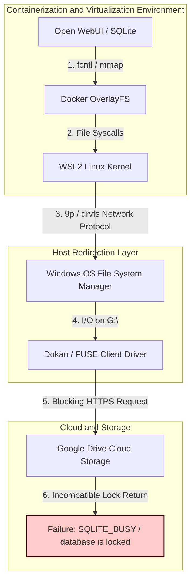
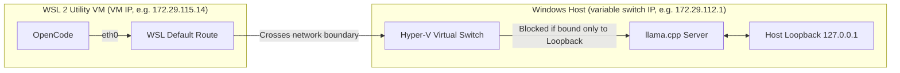
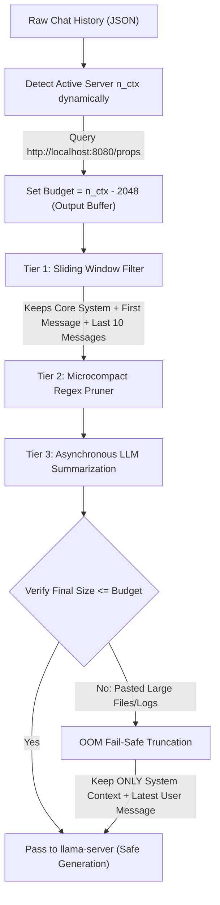

# Troubleshooting Log 📓

This log exhaustively documents, at an academic engineering level, the most complex technical challenges resolved during the design and implementation of your local AI environment. Retain it as a historical, architectural, and support reference for future system expansions.

---

## 💾 Challenge 1: SQLite Locks on Virtual and Synchronized File Systems (Google Drive G:\)

### ❌ The Problem (Root Cause Analysis)
When initializing **Open WebUI** via Docker within a directory hosted on the Google Drive virtual drive (`G:\My Drive\`), the container failed immediately during its startup phase or threw critical runtime errors:
```
sqlite3.OperationalError: database is locked
sqlite3.DiskI/OError: disk I/O error
```

#### 1. SQLite Locking Mechanism and VFS (Virtual File System)
SQLite implements a *serverless* database model where transactional integrity (ACID) and mutual exclusion are managed directly at the operating system file-system call level through its **VFS (Virtual File System)** layer. 
- In Unix/Linux environments, SQLite utilizes POSIX advisory locks via `fcntl(fd, F_SETLK, ...)` or `lockf`.
- In Windows systems, the native VFS layer invokes the `LockFileEx` and `UnlockFileEx` APIs to restrict access to specific byte ranges within the database file (typically starting at offset `0x40000000` or 1 GB).

#### 2. Virtual File System Incompatibility (Google Drive Stream / Dokan / FUSE)
The virtual drive `G:\` is not a local physical file system (such as NTFS or ext4), but rather a logical interface mounted by the Google Drive desktop client utilizing a user-mode file system driver like **Dokan** (on Windows) or **FUSE** (on macOS/Linux).
These virtual systems introduce severe limitations:
- **Absence of Byte-Range Locking**: Google Drive Stream does not fully or consistently implement byte-range locking APIs (`LockFileEx`). When it receives a lock request from the SQLite engine through the Dokan driver, it often responds with error codes like `ERROR_NOT_SUPPORTED` or, worse, simulates a fictitious asynchronous success without guaranteeing actual mutual exclusion.
- **WAL (Write-Ahead Logging) Mode and Memory Mapping (`mmap`)**: Open WebUI configures SQLite in WAL mode to optimize read/write concurrency. This mode requires the creation of a shared memory index file with a `.shm` extension. SQLite attempts to map this file into the process's virtual address space using `mmap()` with the `MAP_SHARED` flag. FUSE/Dokan drivers and network/cloud file systems do not support `mmap` calls with cross-process shared-memory coherence, resulting in an immediate failure of type `SQLITE_IOERR_SHMOPEN` or `SQLITE_CANTOPEN`.

#### 3. Overhead and State Loss in the Virtualization Chain
When the Docker container attempts to write to a bind-mounted folder mapped to Google Drive, the request must traverse a complex technology translation chain:



Throughout this path, the lock state is corrupted, delayed, or ignored, preventing the atomic synchronization required to write safely to the Open WebUI database.

---

### ✔️ The Solution (Novel Architecture)
The definitive solution consisted of decoupling the database storage from the host's virtual file system, reconfiguring `docker-compose.yml` to utilize a **Native Docker Named Volume** (`open-webui-data`):

```yaml
services:
  open-webui:
    image: ghcr.io/open-webui/open-webui:main
    container_name: open-webui
    volumes:
      - open-webui-data:/app/backend/data
...
volumes:
  open-webui-data:
```

#### Mechanical Advantages of the Named Volume:
1. **Complete Bypass of the Dokan/FUSE Driver**: The named volume is stored and managed within the native file system of the Docker support virtual machine (WSL2), typically formatted as **ext4** inside the physical virtual hard disk `ext4.vhdx`.
2. **Full Kernel API Support**: Running locally on ext4 allows the SQLite database engine to invoke `fcntl()` and `lockf()` calls, and implement true memory mapping `mmap(..., MAP_SHARED)` on the `-shm` file with zero latency and 100% full compatibility.
3. **Secure Persistence and Optimized Performance**: I/O speeds increase exponentially by avoiding synchronous network traffic to verify metadata in the Google Drive cloud, guaranteeing immunity against database corruption.

> [!TIP]
> **Production Recommendation**: Always keep high-frequency read/write transactional databases (such as SQLite, PostgreSQL, or MySQL) within Docker named volumes. If you require backups in Google Drive, implement a cron script that performs an asynchronous `sqlite3 .backup` and copies the resulting file to the virtual folder.

---

## 🌐 Challenge 2: Network Isolation and IP Variability in WSL 2

### ❌ The Problem (Root Cause Analysis)
When attempting to interconnect development tools such as **OpenCode** inside WSL 2 (Ubuntu) with the local **llama.cpp** inference server running on the host Windows operating system, connections consistently failed:
```
curl: (7) Failed to connect to 127.0.0.1 port 8080: Connection refused
```

#### 1. WSL 2 Network Architecture: Isolation via NAT
Unlike WSL 1, which shared the same network namespace and network interface with Windows (allowing direct access via `localhost`), WSL 2 is a lightweight **Utility VM (Utility Virtual Machine)** running on a customized Hyper-V hypervisor.
- WSL 2 has its own virtualized network interface (`eth0`) with its own independent TCP/IP kernel stack.
- By default, WSL 2 networking operates in **NAT (Network Address Translation)** mode. The Linux virtual machine connects to an **Internal Hyper-V Virtual Switch** created in Windows.



#### 2. Dynamic Subnets and Volatile DHCP
Each time Windows boots, or when certain network events occur (such as connecting/disconnecting from a Wi-Fi network or a VPN), the Hyper-V virtual switch DHCP service randomly generates a private subnet block (typically within the `172.16.0.0/12` or `192.168.0.0/16` ranges). This automatically changes both the IP address assigned to the WSL 2 VM's `eth0` interface and the virtual gateway address (the Windows host). This makes it impossible to define a static IP in configuration files.

#### 3. Socket Binding Restrictions (The `127.0.0.1` Issue)
If the `llama.cpp` inference server is started on Windows and binds exclusively to the local loopback address (`127.0.0.1`), it will only accept internal local connections originating within the Windows kernel itself. Due to network isolation, requests coming from the WSL 2 adapter crossing the Hyper-V virtual switch are treated as external traffic and are discarded by the Windows Firewall or the TCP/IP stack itself with a `Connection refused` error.

---

### ✔️ The Solution (On-the-Fly Dynamic IP Resolution)
To overcome gateway IP volatility and binding restrictions, we implemented a hybrid flow consisting of socket reconfiguration and dynamic route extraction:

#### 1. Open Socket Configuration on the Server (`llama.cpp`)
We configured `llama.cpp` on the Windows host to listen on all available network interfaces using the special address `0.0.0.0` on port `8080`. This allows it to accept traffic originating both from the Windows loopback interface (`127.0.0.1`) and across the Hyper-V virtual switch from WSL 2.

#### 2. Dynamic Resolution Script at Terminal Startup
We created the `configure_opencode.sh` script, which injects an active detection mechanism into the Bash startup file (`~/.bashrc`) by reading the Linux kernel routing table directly:

```bash
# Dynamic extraction of the Windows host gateway
export OPENCODE_API_BASE="http://$(ip route | grep default | awk '{print $3}'):8080/v1"
```

##### Mechanical Breakdown of the Command:
- `ip route`: Queries the configured routes in the WSL 2 Linux kernel.
- `grep default`: Filters the line defining the default gateway. A typical output is: `default via 172.29.112.1 dev eth0 proto kernel onlink`.
- `awk '{print $3}'`: Extracts the third space-delimited token, which corresponds exactly to the current IP address of the Windows host inside the Hyper-V switch.

#### 3. Dynamic Configuration of the OpenCode Extension
The global OpenCode configuration file (`opencode.json`) was structured to consume this environment variable on the fly:
```json
"options": {
  "baseURL": "{env:OPENCODE_API_BASE}"
}
```

> [!NOTE]
> **Mirrored Networking Mode**: In Windows 11 versions (23H2 or higher) and WSL 2.0+, it is possible to enable mirrored network mode by adding `networkingMode=mirrored` in the `%USERPROFILE%\.wslconfig` file. This unifies the interfaces and allows connecting via `localhost` bidirectionally, simplifying the topology. However, the NAT gateway method implemented here guarantees maximum backward compatibility and stability across any version of Windows 10/11 without requiring global administrative privileges.

---

## 💻 Challenge 3: Silent Crash of Windows CMD When Processing Parenthesized Blocks and Byte Encoding Errors

### ❌ The Problem (Root Cause Analysis)
During the development of the unified automation script `start-llama.bat`, executing the file and attempting to interact with the AI engine selection menus (1, 2, or 3) caused the Windows Command Prompt (`cmd.exe`) to instantly and silently close, without reporting any errors or leaving logs in the Windows Event Viewer.

This catastrophic behavior was caused by two critical limitations inherent to the legacy syntax parser of `cmd.exe`:

#### 1. The Limitation of Double-Colon (`::`) Comments Inside Multiline Parenthesized Blocks
In Windows batch scripting, it is common practice to use `::` as a quick shorthand for comments. However, from a technical and internal perspective of the command processor, `::` is not a real comment command, but rather an **invalid jump label declaration** (a label starting with an additional non-alphanumeric `:` character, which prevents it from being the target of a `goto` statement). Because of this, `cmd.exe` discards it during the normal execution of individual lines.

However, when `cmd.exe` processes a multiline structure grouped by parentheses (such as `if ( ... ) else ( ... )` blocks or `for ( ... )` loops), the parser switches to a single-block processing mode:
- The CMD parser performs a complete lexical analysis of the *entire* parenthesized block before beginning to execute the block's first line of code.
- During this lexical analysis, the parser seeks to match opening and closing parentheses and register control structures.
- If it encounters a label token (any line starting with a single colon `:`, which includes `::`), the `cmd.exe` parser suffers a severe internal error, as jump labels **are strictly prohibited by specification inside parenthesized blocks**.
- The parser misinterprets the internal label, breaks the balance of internal parentheses, and the syntax flow collapses. Failing to recover from this structural discrepancy during the preliminary syntax parsing phase, `cmd.exe` immediately aborts execution of the entire process, abruptly and silently closing the terminal.

#### 2. Lexical Corruption by Unicode Characters and Emojis in OEM Code Pages
By default, the Spanish Windows command prompt operates under code page **OEM 850** (or **OEM 437** in the US), which is a single-byte (8-bit) character encoding designed for the MS-DOS era.

When saving automated scripts using modern **UTF-8** encoding, each emoji (such as 💻, 🚀, 🌋) and accented letter is represented in memory by a multi-byte sequence of 2 to 4 bytes (for example, the 🚀 emoji is represented by the bytes `0xF0 0x9F 0x9A 0x80`).

When the `cmd.exe` engine sequentially processes the file in UTF-8 mode under an 8-bit OEM code page, the following parsing failures occur:
- The parser reads each byte of the multi-byte sequence individually and in isolation.
- If any of these individual bytes matches the ASCII numerical value of a special Batch control character (for example, the closing parenthesis `)` represented by `0x29`, the concatenation character `&` represented by `0x26`, or the redirector `>` represented by `0x3E`), the CMD parser will erroneously believe it has found a syntax delimiter.
- If the second or third byte of an emoji or accented letter accidentally matches the `0x29` byte, the CMD parser will interpret that a parenthesized block has been prematurely closed. This causes the remainder of the code block to become syntactically misaligned, triggering a fatal syntax error that immediately terminates the terminal session.

---

### ✔️ The Solution (Robustness Optimization and Sequential Redesign)
We corrected these structural design flaws by applying a refactoring based on modern Windows terminal engineering standards:

#### 1. Substitution of `::` with `rem` in Logical Blocks
We replaced all instances of shorthand `::` comments located inside parenthesized structures with the native **`rem` (Remark)** command.
`rem` is an official CMD builtin command and is processed cleanly as an inert statement token by the parser during the lexical analysis phase, avoiding any interference with grouping parentheses:

| Comment Type | Allowed inside Parenthesized Blocks `( )`? | Impact on the `cmd.exe` Parser |
| :--- | :--- | :--- |
| **`::` (False Label)** | **NO** ❌ | Causes parenthesis misalignment, lexical syntax error, and silent closure of the console. |
| **`rem` (Native builtin)** | **YES** ✔️ | Processed correctly as an inert command and ignored without affecting execution. |

#### 2. Migration to a Flat Execution Model
To immunize the script against encoding variability and eliminate the risk of multi-byte sequence collisions with control parentheses, we redesigned the `start-llama.bat` script by removing all multiline code blocks grouped by parentheses.
We implemented a **sequential flat execution flow** using single-line conditionals and explicit jumps with labels (`goto`):

```batch
:: BEFORE (Crash-prone design)
if "%opcion%"=="1" (
    :: Use CPU engine
    echo Seleccionó CPU
    set ENGINE=cpu
    goto start
)

:: NOW (100% robust linear design immune to collisions)
if "%opcion%"=="1" goto option_cpu
...
:option_cpu
rem Use CPU engine
echo Selecciono CPU
set ENGINE=cpu
goto start
```

#### 3. Dynamically Forcing UTF-8 and Removing BOM
- **UTF-8 Code Page (65001)**: We added the `chcp 65001 > nul` instruction at the beginning of the script to dynamically configure console input and output to 16-bit UTF-8.
- **No-BOM Formatting (Byte Order Mark)**: We ensured the `.bat` file was saved using **UTF-8 without BOM** encoding. If a batch file includes the BOM signature header bytes (`0xEF 0xBB 0xBF`) at its beginning, `cmd.exe` will attempt to parse them as ordinary commands on the first line, resulting in unrecognized command errors.
- **Character Cleanup**: Emojis were removed from inside internal logical flow variables and variable names, keeping them only within static plain text screen output (`echo`), ensuring maximum compatibility in any version of Windows CMD.

---

## 🤖 Challenge 4: Context Drift and Out-of-Memory (OOM) Errors on Edge Devices (16GB RAM) Running Autonomous Loops

### ❌ The Problem (Root Cause Analysis)
When deploying local "Edge" models like Qwen 2.5 Coder 3B or Gemma 2 2B inside autonomous agent sessions (e.g., in OpenCode) with high-frequency tool executions, the agent session would consistently collapse after 15 to 20 cycles. The degradation manifested in two distinct behaviors:
1.  **Context Drift:** The agent forgot its original task alignment, ignored system instructions, or repeated the last tool call infinitely (cognitive loop).
2.  **KV Cache VRAM/RAM Out-Of-Memory (OOM):** The local `llama-server` crashed with allocation failures as the Key-Value (KV) cache grew quadratically, exceeding the physical VRAM or host memory boundary.

#### 1. Context Window Exhaustion in Edge Architectures
Although next-generation GGUF models support large theoretical context sizes (up to 128K), consumer-grade edge hardware (16GB RAM Laptop without heavy GPU offloading) suffers from severe compute and memory constraints:
*   An 8K context on a 3B model consumes approximately 1.5 GB of RAM for the KV Cache under 16-bit precision. In a loop, as context grows, the time-per-token decode rate slows down exponentially (due to cache misses and CPU bottleneck), and RAM usage spikes until the system initiates SSD page-swapping, paralyzing performance.
*   Once the window exceeds the hardware threshold, the model fails to map long-range attention sequences, dropping the system prompt and starting to hallucinate.

---

### ✔️ The Solution (Dynamic Context Resolution & OOM Fail-Safe)
We solved this by transforming our static context management into a highly adaptive, dynamic system paired with an emergency OOM Fail-Safe buffer, preventing errors of type `request (X tokens) exceeds the available context size (Y tokens)` at the socket layer.



1.  **Dynamic Context Limit Discovery (`n_ctx`):**
    Rather than relying on a hardcoded, rigid token budget in the `.env` file (e.g. `6000`), the compactor script (`context-compactor.py`) dynamically queries `llama-server` at startup via the `/props` endpoint. It retrieves the exact active server context size (`n_ctx`, e.g. `8192` or `16384` tokens).
2.  **Dynamic Budget Calculations:**
    To ensure the model never crashes during text decoding, the system dynamically calculates the input budget on the fly:
    $$\text{Dynamic Budget} = \text{Server n\_ctx} - \text{Generation Output Buffer (2048 tokens)}$$
    This guarantees a dedicated output window of 2,048 tokens for response generation. If the server is offline or unreachable, the compactor cleanly falls back to the static config budget.
3.  **Active 3-Tier Compaction Execution:**
    *   **Tier 1**: Removes intermediate conversation history, preserving the core system prompt, the persistent root-level `PROJECT.md` context, and a sliding window of the latest messages.
    *   **Tier 2 (Regex Pruner)**: Sweeps raw terminal output blocks, Base64 image tags, and repetitive logs.
    *   **Tier 3**: Runs asynchronous summarization of older history at a low, deterministic temperature (`0.3`) through the local API.
4.  **OOM Fail-Safe Truncation (The Ultimate Safeguard):**
    If the user pastes an exceptionally large file or log block in their current prompt, even after running all three tiers, the combined context size may still exceed the dynamic budget (resulting in the `request (8487 tokens) exceeds the available context size (8192 tokens)` error).
    The compactor now enforces an **OOM Fail-Safe**: if the post-compact token size exceeds the budget, it immediately drops *all* remaining historical turns and summaries, passing *exclusively* the system prompt + the latest user message. This slices context usage to the absolute minimal functional subset, ensuring the inference request succeeds.


---

## 💻 Challenge 5: Working Tree Corruption in Autonomous Programming Loops

### ❌ The Problem (Root Cause Analysis)
When the local programming agent (OpenCode) is set to an autonomous "code execution" loop (e.g., a "Fix all compilation warnings" instruction), it writes and compiles files repeatedly. If the agent gets stuck in a logic loop:
*   It continuously edits source files, adding redundant abstractions or garbage try-catch blocks.
*   It leaves half-written or corrupted Python/JSON files in the working directory when interrupted or when hitting maximum retries, corrupting the user's workspace with no easy way to roll back.

---

### ✔️ The Solution (Interactive Risk Gating and Git Snapshot Hooks)
We implemented a strict security harness that automatically isolates working tree states and verifies logical correctness at the shell layer:

#### 1. Interactive Risk Gating (`tool_permissions.json`)
Every file modification (`edit_file`, `write_file`) is categorized as `MEDIUM` risk, and direct CLI execution (`bash`) as `HIGH` risk. If the agent attempts a command matching a blacklisted pattern (`rm -rf`, `sudo`, etc.), the routing layer immediately halts execution.

#### 2. Automatic Git Stash Push Snapshotting (`pre_action.sh`)
When a medium or high-risk action is initiated, the system immediately runs `pre_action.sh`:
```bash
if ! git diff --quiet || ! git diff --cached --quiet; then
    git stash push -m "pre-action-hook: ${ACTION_TYPE} - ${TIMESTAMP}" --include-untracked
fi
```
This isolates the untracked and modified workspace changes into a temporary Git stash before the agent applies any changes. If the agent fails, the user can instantly restore their workspace via `git stash pop`.

#### 3. Post-Action Abstract Syntax Tree (AST) Auditing (`post_action.sh`)
Immediately after a file is edited, the `post_action.sh` hook runs static code validation before returning control to the agent:
*   *For Python*: Runs `python3 -c "import ast; ast.parse(open(file).read())"`. If the code contains indentation errors or syntax anomalies, the compilation fails, returning the exact traceback to the agent's context to force immediate self-correction.
*   *For JSON*: Validates schema integrity via Python's native `json.load`, preventing corrupted configuration states.

---

## ⚙️ Challenge 6: Windows Batch File Fragility and Lexical Collisions

### ❌ The Problem (Root Cause Analysis)
As the launcher script (`start-llama.bat`) evolved to support hardware autodetect, DLL copying, multi-category scanning, and user parameters, it exceeded **500 lines of Windows Command Prompt Batch code**. This resulted in severe regression issues:
1.  **Delayed Expansion Errors:** CMD handles variable evaluations synchronously. Reading variables set inside parenthesized loops (like parsing GGUFs or checking CUDA versions) requires complex `setlocal enabledelayedexpansion` syntax and exclamation marks `!VAR!`, which breaks standard quotes.
2.  **Lexical Parsing Collisions:** Spaces in the folder path (e.g. `c:\temp\AI Local\`) crashed the script randomly during loops if a single quotation mark was mismatched.
3.  **Silent Thread Leakage (Zombie Servers):** Batch scripts cannot easily capture background process IDs on Windows, leaving old `llama-server.exe` instances running invisibly in the background when swapping models. This led to silent GPU VRAM/RAM allocation leaks.

---

### ✔️ The Solution (Modular Python SoC Refactoring)
We successfully resolved this by applying a clean **Separation of Concerns (SoC)**, refactoring the launcher into a modular Python backend encapsulated in a lightweight CMD wrapper:

1.  **Lightweight Batch Wrapper (`start-llama.bat`):**
    A zero-dependency bootstrap wrapper of just 40 lines. It checks if `python` or `python3` is available on the path, and transparently executes `python scripts/launcher/main.py`. If missing, it provides clear instructions in Spanish for the user to install Python and add it to `PATH`.
2.  **Modular Python Subsystems (`scripts/launcher/`):**
    *   `main.py`: Handles terminal menus and flow routing.
    *   `hardware.py`: Natively queries the OS for physical CPU core boundaries and executes NVIDIA CUDA / Vulkan hardware detection.
    *   `models.py`: Scans GGUFs. Implements an **Ollama-style pull downloader** that retrieves GGUF files directly from HuggingFace using a beautiful, real-time CLI progress bar, eliminating manual downloads.
    *   `config.py`: Optimizes parameters and compiles PolarQuant flags (Q4_0, Q8_0, Flash Attention).
    *   `server.py`: Manages the server subprocess lifecycle, redirects outputs to `logs/active_server.log`, and enforces clean **Model Hot-Swapping** (automatically killing any background/zombie servers before loading a new model to avoid VRAM leaks).


